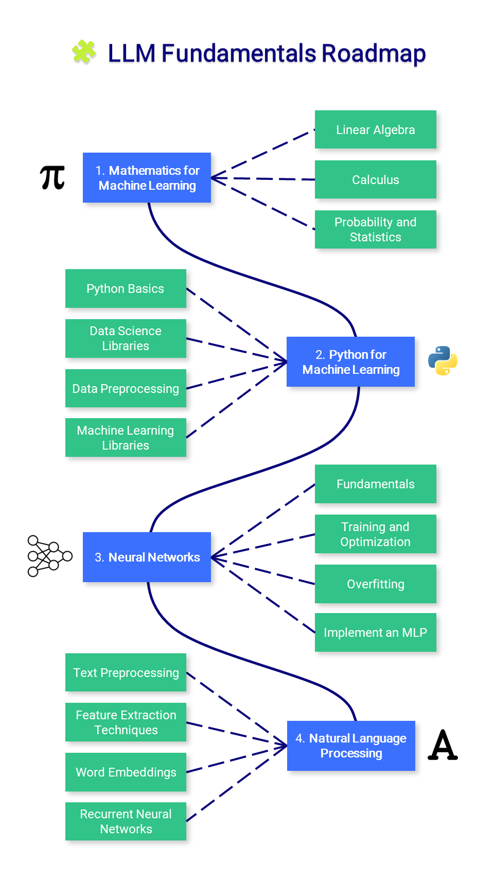

# LLM 基础知识
## 学习路线

本部分介绍构建和理解大语言模型所需的基础知识,包括:

1. [数学基础](./math/index.md)
2. [Python 编程基础](./python/index.md)
3. [神经网络基础](./neural_networks/index.md)
4. [自然语言处理基础](./nlp/index.md)

!!! note "提示"
    基础知识部分是可选的。如果你已经具备相关知识，可以直接进入后续章节。但扎实的基础将帮助你更好地理解和应用 LLM 技术。

## 重要性

扎实的基础知识将帮助你:

- 更深入地理解 LLM 的工作原理
- 更好地调试和优化模型
- 在实践中解决问题 