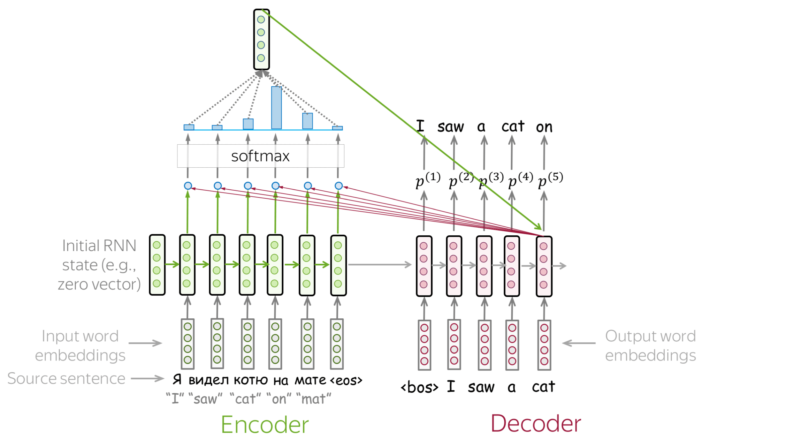
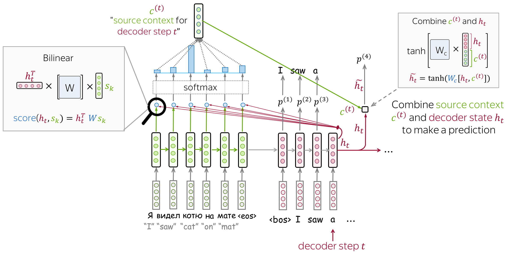

# Attention
!!! info "Document Source"
    This document is adapted from Lena Voita's [NLP Course | Sequence to Sequence (seq2seq) and Attention](https://lena-voita.github.io/nlp_course/seq2seq_and_attention.html).
    
    Original author: [Lena Voita](https://lena-voita.github.io/)
    
## The Problem of Fixed Encoder Representation

!!! warning "Problem"
    Fixed source representation is suboptimal for two reasons:

    1. (1) For the encoder, it is hard to compress the sentence;
    2. (2) For the decoder, different information may be relevant at different steps.

{: align=right style="max-width:60%; margin-left:20px;"}

In the models we looked at so far, the encoder compressed the whole source sentence into a single vector. This can be very hard - the number of possible source sentences (hence, their meanings) is infinite. When the encoder is forced to put all information into a single vector, it is likely to forget something.

!!! note "Lena says"
    Imagine the whole universe in all its beauty - try to visualize everything you can find there and how you can describe it in words. 
    Then imagine all of it is compressed into a single vector of size 512. Do you feel that the universe is still ok?

Not only it is hard for the encoder to put all information into a single vector - this is also hard for the decoder. The decoder sees only one representation of source. However, at each generation step, different parts of source can be more useful than others. But in the current setting, the decoder has to extract relevant information from the same fixed representation - hardly an easy thing to do.

## Attention: A High-Level View

Attention was introduced in the paper [Neural Machine Translation by Jointly Learning to Align and Translate](https://arxiv.org/pdf/1409.0473.pdf) to address the fixed representation problem.

> *Attention*: **At different steps, let a model "focus" on different parts of the input.**

Attention mechanism is a part of a neural network. At each decoder step, it decides which source parts are more important. In this setting, the encoder does not have to compress the whole source into a single vector: it gives representations for all source tokens (for example, all RNN states instead of the last one).

At each decoder step, attention:

1.Receives **attention input**: (1) a decoder state $\color{#b01277}{h_t}$; (2) all encoder states $\color{#7fb32d}{s_1}$, $\color{#7fb32d}{s_2}$, ..., $\color{#7fb32d}{s_m}$;

2.Computes **attention scores**: For each encoder state $\color{#7fb32d}{s_k}$, attention computes its "relevance" for this decoder state $\color{#b01277}{h_t}$. Formally, it applies an attention function which receives one decoder state and one encoder state and returns a scalar value $\color{#307cc2}{score}(\color{#b01277}{h_t}\color{black}{,}\color{#7fb32d}{s_k}\color{black})$;

3.Computes **attention weights**: probability distribution - softmax applied to attention scores;

4.Computes **attention output**: the weighted sum of encoder states with attention weights.

The following figure illustrates the general computation process:

{: style="max-width:80%; margin: 20px auto; display: block;"}

<h3><strong>Note:</strong> Everything is differentiable - learned end-to-end!</h3>

The key idea is that a network can **learn** which input parts are more important at each step. Since everything here is differentiable (attention function, softmax, and all the rest), a model with attention can be trained end-to-end. You don't need to specifically teach the model to pick the words you want - **the model itself will learn to pick important information**.

!!! example "How to"
    Go over the slides at your pace. Try to notice how attention weights change from step to step - which words are the most important at each step?

    

        
    

    

        
    

    

        
    

    

        
    

    

        
    

    

        
    

    

        
    

    

        
    

## How to Compute Attention Score?

{: align=right style="max-width:35%; margin-left:20px;"}

In the general pipeline above, we haven't specified how exactly we compute attention scores. You can apply any function you want - even a very complicated one. However, usually you don't need to - there are several popular and simple variants which work quite well.

{: style="max-width:90%; margin: 20px auto; display: block;"}

The most popular ways to compute attention scores are:

- **dot-product** - the simplest method;
- **bilinear function** (aka "Luong attention") - used in the paper [Effective Approaches to Attention-based Neural Machine Translation](https://arxiv.org/abs/1508.04025);
- **multi-layer perceptron** (aka "Bahdanau attention") - the method proposed in the [original paper](https://arxiv.org/pdf/1409.0473.pdf).

## Model Variants: Bahdanau and Luong

When talking about the early attention models, you are most likely to hear these variants:

- **Bahdanau attention** - from the paper [Neural Machine Translation by Jointly Learning to Align and Translate](https://arxiv.org/pdf/1409.0473.pdf) by Dzmitry Bahdanau, KyungHyun Cho and Yoshua Bengio (this is the paper that introduced the attention mechanism for the first time);
- **Luong attention** - from the paper [Effective Approaches to Attention-based Neural Machine Translation](https://arxiv.org/abs/1508.04025) by Minh-Thang Luong, Hieu Pham, Christopher D. Manning.

These may refer to either score functions or the whole models used in these papers. In this part, we will look more closely at these two model variants.

### Bahdanau Model

**Encoder: bidirectional**

  - To better encode each source word, the encoder has two RNNs, forward and backward, which read input in the opposite directions;
  - For each token, states of the two RNNs are concatenated;

**Attention score: multi-layer perceptron**

  - To get an attention score, apply a multi-layer perceptron (MLP) to an encoder state and a decoder state;

**Attention applied: between decoder steps**

  - Attention is used between decoder steps: state $\color{#b01277}{h_{t-1}}$ is used to compute attention and its output $\color{#7fb32d}{c}^{\color{#b01277}{(t)}}$;
  - Both $\color{#b01277}{h_{t-1}}$ and $\color{#7fb32d}{c}^{\color{#b01277}{(t)}}$ are passed to the decoder at step $t$;

{: style="max-width:100%; margin: 20px auto; display: block;"}

### Luong Model

While the [paper](https://arxiv.org/abs/1508.04025) considers several model variants, the one which is usually called "Luong attention" is the following:

**Encoder: unidirectional** (simple)

**Attention score: bilinear function**

**Attention applied: between decoder RNN state $t$ and prediction for this step**

  - Attention is used after RNN decoder step $t$ before making a prediction;
  - State $\color{#b01277}{h_{t}}$ used to compute attention and its output $\color{#7fb32d}{c}^{\color{#b01277}{(t)}}$;
  - Then $\color{#b01277}{h_{t}}$ is combined with $\color{#7fb32d}{c}^{\color{#b01277}{(t)}}$ to get an updated representation $\color{#b01277}{\tilde{h}_{t}}$, which is used to get a prediction.

{: style="max-width:100%; margin: 20px auto; display: block;"}

!!! info "Two Variants of Luong Attention"
    Based on where attention is placed, Luong proposed two types of attention mechanisms in the paper:

    - **Global Attention**: attention is placed on all source positions;
    - **Local Attention**: attention is placed only on a small subset of the source positions per target word.

    For a more detailed explanation of these two attention mechanisms, you can refer to the note [Attention: Sequence 2 Sequence model with Attention Mechanism](https://medium.com/towards-data-science/sequence-2-sequence-model-with-attention-mechanism-9e9ca2a613a)

## Attention and Alignment

Remember the motivation for attention? At different steps, the decoder may need to focus on different source tokens, the ones which are more relevant at this step. Let's look at attention weights - which source words does the decoder use?

{: style="max-width:100%; margin: 20px auto; display: block;"}
*The examples are from the paper [Neural Machine Translation by Jointly Learning to Align and Translate](https://arxiv.org/pdf/1409.0473.pdf)*

From the examples, we see that attention learned (soft) alignment between source and target words - the decoder looks at those source tokens which it is translating at the current step.

!!! note "Lena says"
    "Alignment" is a term from statistical machine translation, but in this part, its intuitive understanding as "what is translated to what" is enough.

