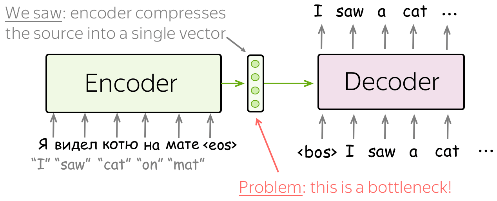
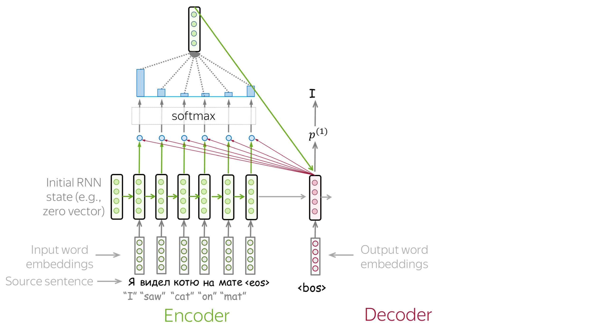
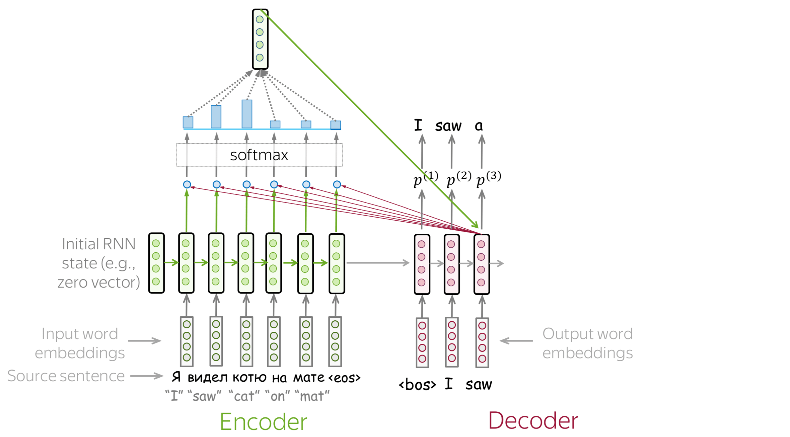
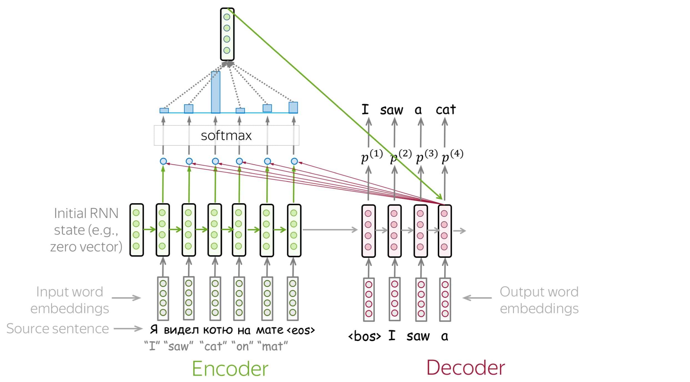
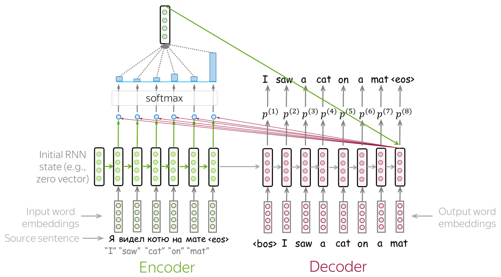
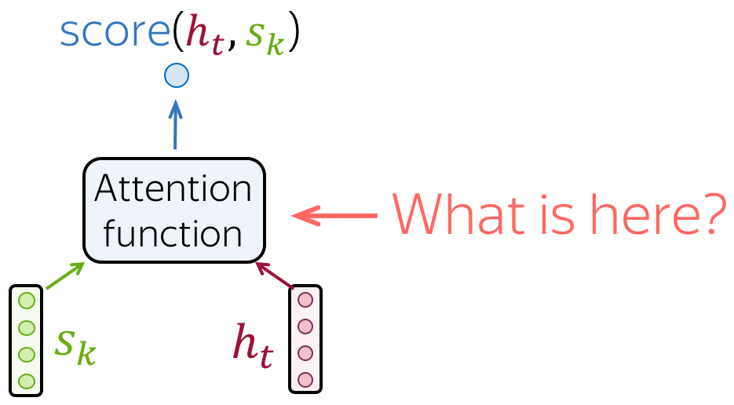
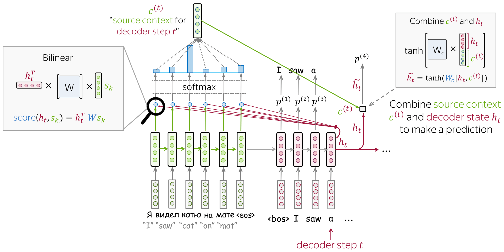
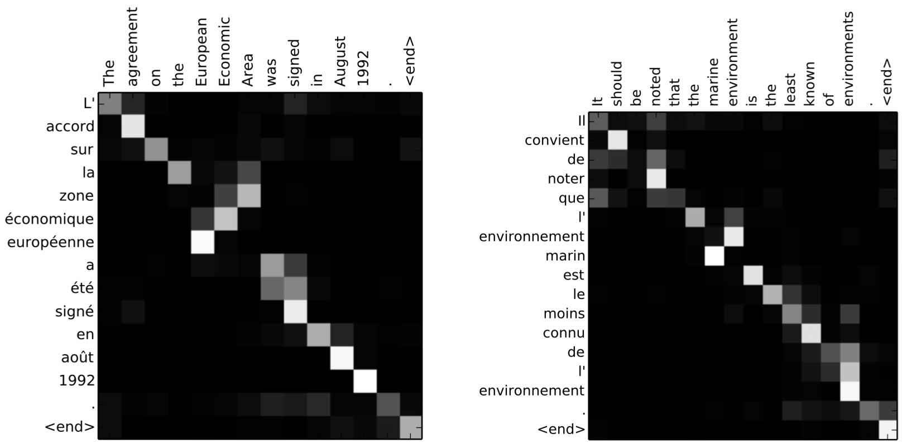

# 注意力机制

!!! info "文档来源"
    本文档改编自 Lena Voita 的 [NLP Course | Sequence to Sequence (seq2seq) and Attention](https://lena-voita.github.io/nlp_course/seq2seq_and_attention.html)。
    
    原作者：[Lena Voita](https://lena-voita.github.io/)

## 固定编码器表示的问题

!!! warning "问题"
    固定的源表示是次优的，原因有二：

    1. (1) 对编码器来说，压缩整个句子很困难；
    2. (2) 对解码器来说，在不同步骤可能需要关注不同的信息。

{: align=right style="max-width:60%; margin-left:20px;"}

在我们之前看到的模型中，编码器将整个源句子压缩成一个单一的向量。这可能非常困难 —— 可能的源句子（以及它们的含义）是无限的。当编码器被迫将所有信息放入单个向量时，很可能会遗漏一些信息。

!!! note "Lena 说"
    想象整个宇宙的所有美丽 —— 试着想象你能在那里找到的一切，以及你如何用语言描述它。
    然后想象所有这些都被压缩成一个大小为 512 的单一向量。你觉得这个宇宙还好吗？

不仅编码器很难将所有信息放入单个向量，对解码器来说也很困难。解码器只能看到源的一个表示。然而，在每个生成步骤中，源的不同部分可能比其他部分更有用。但在当前设置中，解码器必须从同一个固定表示中提取相关信息 —— 这显然不是一件容易的事。

## 注意力机制：高层视角

注意力机制在论文 [Neural Machine Translation by Jointly Learning to Align and Translate](https://arxiv.org/pdf/1409.0473.pdf) 中被引入，用于解决固定表示的问题。

> *注意力*：**在不同的步骤中，让模型能够 "关注" 输入的不同部分。**

注意力机制是神经网络的一部分。在每个解码器步骤中，它决定哪些源部分更重要。在这种设置下，编码器不必将整个源压缩成单个向量：它为所有源标记提供表示（例如，使用所有 RNN 状态而不是最后一个）。

在每个解码器步骤中，注意力机制会：

1.接收**注意力输入**：包括 (1) 一个解码器状态 $\color{#b01277}{h_t}$；(2) 所有编码器状态 $\color{#7fb32d}{s_1}$、$\color{#7fb32d}{s_2}$、...、$\color{#7fb32d}{s_m}$；

2.计算**注意力分数**：对每个编码器状态 $\color{#7fb32d}{s_k}$，注意力计算其对这个解码器状态 $\color{#b01277}{h_t}$ 的"相关性"。形式上，它应用一个注意力函数，接收一个解码器状态和一个编码器状态，返回一个标量值 $\color{#307cc2}{score}(\color{#b01277}{h_t}\color{black}{,}\color{#7fb32d}{s_k}\color{black})$；

3.计算**注意力权重**：对注意力分数应用 softmax 得到概率分布；

4.计算**注意力输出**：用注意力权重对编码器状态进行加权求和。

下图描述了一般的计算过程：

{: style="max-width:80%; margin: 20px auto; display: block;"}

<h3><strong>注意：</strong>所有计算都是可微的 —— 端到端学习！</h3>

关键思想是网络可以**学习**在每一步哪些输入部分更重要。由于这里的所有内容都是可微的（注意力函数、softmax 和所有其他部分），带注意力机制的模型可以进行端到端训练。你不需要专门去教模型选择你想要的词 —— **模型自己会学会选择重要信息**。

!!! example "逐步观察"
    请按照自己的节奏浏览以下幻灯片。试着注意每一步注意力权重的变化：在每一步中哪些词是最重要的？

    

        
    

    

        
    

    

        
    

    

        
    

    

        
    

    

        
    

    

        
    

    

        
    

## 如何计算注意力分数？

{: align=right style="max-width:35%; margin-left:20px;"}

在上面的一般流程中，我们还没有具体说明如何计算注意力分数。你可以应用任何你想要的函数 —— 甚至是非常复杂的函数。然而，通常你并不需要这样做 —— 有几个简单且流行的变体已经工作得很好。

{: style="max-width:90%; margin: 20px auto; display: block;"}

计算注意力分数最流行的方法有：

- **点积（dot-product）** - 最简单的方法；
- **双线性函数（bilinear function）**（又称"Luong 注意力"）- 在论文 [Effective Approaches to Attention-based Neural Machine Translation](https://arxiv.org/abs/1508.04025) 中使用；
- **多层感知器（multi-layer perceptron）**（又称"Bahdanau 注意力"）- 在[原始论文](https://arxiv.org/pdf/1409.0473.pdf)中提出的方法。

## 模型变体：Bahdanau 和 Luong

当谈到早期的注意力模型时，你最可能听到这些变体：

- **Bahdanau 注意力** - 来自论文 [Neural Machine Translation by Jointly Learning to Align and Translate](https://arxiv.org/pdf/1409.0473.pdf)，作者为 Dzmitry Bahdanau、KyungHyun Cho 和 Yoshua Bengio（这是首次引入注意力机制的论文）；
- **Luong 注意力** - 来自论文 [Effective Approaches to Attention-based Neural Machine Translation](https://arxiv.org/abs/1508.04025)，作者为 Minh-Thang Luong、Hieu Pham、Christopher D. Manning。

这些可能指的是分数函数或这些论文中使用的整个模型。在这部分中，我们将更仔细地看看这两种模型变体。

### Bahdanau 模型

**编码器：双向的**

  - 为了更好地编码每个源词，编码器有两个 RNN，前向和后向，它们以相反的方向读取输入；
  - 对于每个标记，两个 RNN 的状态被连接起来；

**注意力分数：多层感知器**

  - 对编码器状态和解码器状态应用多层感知器（MLP）来获得注意力分数；

**注意力应用：在解码器步骤之间**

  - 注意力在解码器步骤之间使用：状态 $\color{#b01277}{h_{t-1}}$ 用于计算注意力及其输出 $\color{#7fb32d}{c}^{\color{#b01277}{(t)}}$；
  - $\color{#b01277}{h_{t-1}}$ 和 $\color{#7fb32d}{c}^{\color{#b01277}{(t)}}$ 都被传递给步骤 $t$ 的解码器；

{: style="max-width:100%; margin: 20px auto; display: block;"}

### Luong 模型

虽然[论文](https://arxiv.org/abs/1508.04025)考虑了几种模型变体，但通常被称为 "Luong 注意力" 的是以下这种：

**编码器：单向的**（简单）

**注意力分数：双线性函数**

**注意力应用：在解码器 RNN 状态 $t$ 和该步骤的预测之间**

  - 注意力在 RNN 解码器步骤 $t$ 之后、做出预测之前使用；
  - 状态 $\color{#b01277}{h_{t}}$ 用于计算注意力及其输出 $\color{#7fb32d}{c}^{\color{#b01277}{(t)}}$；
  - 然后将 $\color{#b01277}{h_{t}}$ 与 $\color{#7fb32d}{c}^{\color{#b01277}{(t)}}$ 组合得到更新的表示 $\color{#b01277}{\tilde{h}_{t}}$，用于获得预测。

{: style="max-width:100%; margin: 20px auto; display: block;"}

!!! info "Luong 注意力机制的两种变体"
    实际上，基于注意力所在范围，Luong 在论文中提出了两种注意力机制：

    - **全局注意力（Global Attention）**：注意力分布在源序列的所有位置上；
    - **局部注意力（Local Attention）**：对每个目标词，注意力仅分布在源序列一小部分上。

    关于这两种注意力机制的更为具体的解释，可以参考笔记 [Attention: Sequence 2 Sequence model with Attention Mechanism](https://medium.com/towards-data-science/sequence-2-sequence-model-with-attention-mechanism-9e9ca2a613a)

## 注意力与对齐

还记得引入注意力的动机吗？在不同的步骤中，解码器可能需要关注不同的源标记，即在这一步更相关的标记。让我们看看注意力权重 —— 解码器使用了哪些源词？

{: style="max-width:100%; margin: 20px auto; display: block;"}
*示例来自论文 [Neural Machine Translation by Jointly Learning to Align and Translate](https://arxiv.org/pdf/1409.0473.pdf)*

从这些例子中，我们可以看到注意力学习了源和目标词之间的（软）对齐 —— 解码器在当前步骤关注那些它正在翻译的源标记。

!!! note "Lena 说"
    "对齐（alignment）" 是统计机器翻译中的一个术语，但在这部分中，将其直观理解为 "什么翻译成什么" （对应关系）就足够了。
