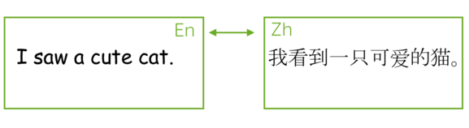
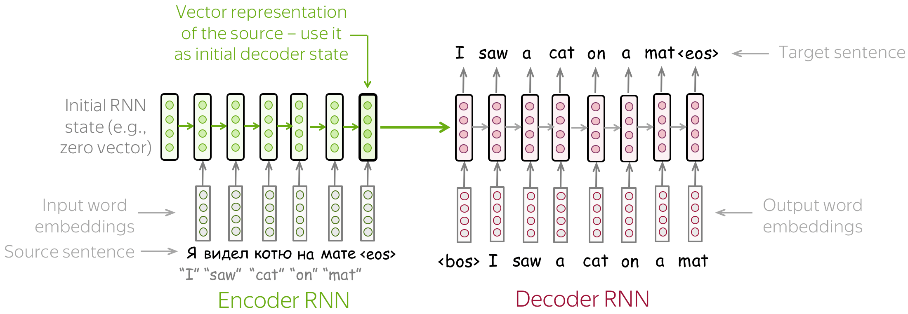
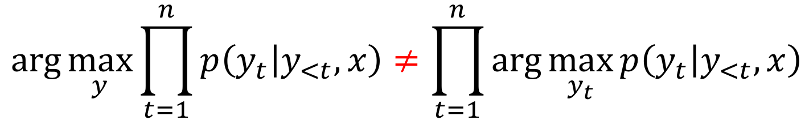

# Sequence to Sequence Models

This video provides a basic introduction to the architecture and working principles of Sequence to Sequence (Seq2Seq) models.

  <iframe width="100%" height="400" src="https://www.bilibili.com/video/BV1Ak4y117P3?vd_source=4637c70bef5449098d67281879acd7eb&p=43&autoplay=0" 
    title="Sequence to Sequence (Seq2Seq) Models Explained" 
    frameborder="0" 
    allow="clipboard-write; encrypted-media; picture-in-picture" 
    allowfullscreen>
  </iframe>

!!! info "Document Source"
    This document is adapted from Lena Voita's [NLP Course | Sequence to Sequence (seq2seq) and Attention](https://lena-voita.github.io/nlp_course/seq2seq_and_attention.html).
    
    Original author: [Lena Voita](https://lena-voita.github.io/)
    
The most popular sequence-to-sequence task is translation: usually from one natural language to another. Commercial systems have made amazing progress in machine translation over the past few years - you can try these systems:

{: align=right style="max-width:70%; margin-left:20px;"}

- [Google Translate](https://translate.google.com)
- [Yandex Translate](https://translate.yandex.com)
- [DeepL Translator](https://www.deepl.com/en/translator)
- [Bing Microsoft Translator](https://www.bing.com/translator)

Today we will learn about the core parts of these systems.

Besides the common machine translation between natural languages, you can translate between programming languages (see Facebook AI blog post [Deep learning to translate between programming languages](https://ai.facebook.com/blog/deep-learning-to-translate-between-programming-languages/)), or between any sequences of tokens you can think of. From now on, we will use **machine translation** to refer to any general sequence-to-sequence task, i.e., translation between sequences of tokens of any nature.

Next, we will first learn the basics of seq2seq, then understand the attention mechanism which is indispensable in all modern systems, and finally we will learn about the most popular model - the Transformer. Of course, there will be lots of analysis, exercises, paper reading, and interesting practice along the way!

## Sequence to Sequence Basics

Formally, in a machine translation task, we have an input sequence $x_1, x_2, \dots, x_m$ and an output sequence $y_1, y_2, \dots, y_n$ (note that their lengths can be different). Translation can be seen as finding the most probable target sequence given the input; formally, finding the target sequence that maximizes the conditional probability $p(y|x)$: $y^{\ast}=\arg\max\limits_{y}p(y|x)$.

If you are bilingual and can easily translate between languages, you have an intuitive feeling for $p(y|x)$, you can say something like "this translation sounds more natural for this sentence". But in machine translation, we learn a function $p(y|x, \theta)$ with parameters $\theta$, and then find its maximum for a given input: $y'=\arg\max\limits_{y}p(y|x, \theta)$.

To define a machine translation system, we need to answer three questions:

- **Modeling** - What does the model $p(y|x, \theta)$ look like?
- **Learning** - How to find parameters $\theta$?
- **Inference** - How to find the best $y$?

In this lecture, we will fully answer the second and third questions, but consider only the simplest model. More "real" models will be discussed in the [Attention](attention.md) and [Transformer](transformer.md) sections.

## The Encoder-Decoder Framework

{: align=right style="max-width:60%; margin-left:20px;"}

The encoder-decoder is a standard modeling paradigm for sequence-to-sequence tasks. This framework contains two components:

- **Encoder** - reads the source sequence and generates its representation
- **Decoder** - uses the source representation generated by the encoder to generate the target sequence

In this lecture and some following lectures, we will see different models, but they all have this encoder-decoder structure.

## Conditional Language Models

While **Language Models**（who can predict and generate the suitable texts in the following from given context）estimate the **unconditional** probability $p(y)$ of a sequence of tokens $y=(y_1, y_2, \dots, y_n)$, **sequence-to-sequence models** need to estimate the **conditional** probability $p(y|x)$ of a sequence $y$ given a source sequence $x$. This is why sequence-to-sequence tasks can be modeled as **conditional language models (CLM)** - they work similarly to language models but additionally receive source information $x$.

{: style="max-width:60%; display: block; margin:20px auto"}

!!! note "Lena says"
    Note that conditional language modeling is not just a way to solve sequence-to-sequence tasks. In the most general sense, $x$ can be something other than a sequence of tokens. For example, in image captioning, $x$ is an image and $y$ is a description of this image.

<video controls loop style="width:90%; display: block; margin:20px auto">
  <source src="./images/seq2seq/enc_dec_prob_idea.mp4" type="video/mp4">
</video>

Since the only difference from language models is the presence of the source sequence $x$, modeling and training are very similar to language models. Specifically, the high-level flow is as follows:

- Input the source sequence and previously generated target words to the network;
- Get vector representation of the context (source and previous target) from the network decoder;
- Predict probability distribution of the next token from this vector representation.

Similar to language models, we can think about the classification part (i.e, how to get token probabilities from text vector representation) in a very simple way. Text vector representation has some dimension $d$, but eventually we need a vector of size $|V|$ (probabilities for $|V|$ tokens/classes). To get from a $d$-dimensional vector to a $|V|$-dimensional vector, we can use a linear layer. Once we have the $|V|$-dimensional vector, all is left is to apply the softmax operation to convert the raw numbers into token probabilities.

## The Simplest Model: Two RNNs for Encoder and Decoder

The simplest encoder-decoder model consists of two RNNs (LSTMs): one for the encoder and another for the decoder. Encoder RNN reads the source sentence, and the final state is used as the initial state of the decoder RNN. The hope is that the final encoder state "encodes" all information about the source, and the decoder can generate the target sentence based on this vector.

This model can have different modifications: for example, the encoder and decoder can have several layers. Such a model with several layers was used, for example, in the paper [Sequence to Sequence Learning with Neural Networks](https://arxiv.org/pdf/1409.3215.pdf) - one of the first attempts to solve sequence-to-sequence tasks using neural networks.

In the same paper, the authors looked at the last encoder state and visualized several examples - look below. Interestingly, representations of sentences with similar meaning but different structure are close!

{: style="display: block; margin: 20px auto"}
*The examples are from the paper [Sequence to Sequence Learning with Neural Networks](https://arxiv.org/pdf/1409.3215.pdf)*

!!! tip "Tip"
    The paper [Sequence to Sequence Learning with Neural Networks](https://arxiv.org/pdf/1409.3215.pdf) introduced an elegant trick to make such a simple LSTM model work better. Learn more in the exercise in the "Research Thinking" section.

## Training: The Cross-Entropy Loss

Similar to neural language models, neural sequence-to-sequence models are trained to predict probability distributions of the next token given previous context (source and previous target tokens). Intuitively, at each step we maximize the probability a model assigns to the correct token.

Formally, let's assume we have a training instance with the source $x=(x_1, \dots, x_m)$ and the target $y=(y_1, \dots, y_n)$. Then at the timestep $t$, a model predicts a probability distribution $p^{(t)} = p(\ast|y_1, \dots, y_{t-1}, x_1, \dots, x_m)$.

The target at this step is $p^{\ast}=\text{one-hot}(y_t)$, i.e., we want a model to assign probability 1 to the correct token, $y_t$, and zero to the rest.

The standard loss function is the **cross-entropy loss**. Cross-entropy loss for the target distribution $p^{\ast}$ and the predicted distribution $p^{}$ is:

$$Loss(p^{\ast}, p^{})= - p^{\ast} \log(p) = -\sum\limits_{i=1}^{|V|}p_i^{\ast} \log(p_i)$$

Since only one of $p_i^{\ast}$ is non-zero (for the correct token $y_t$), we will get:

$$Loss(p^{\ast}, p) = -\log(p_{y_t})=-\log(p(y_t| y_{\text{<}t}, x))$$

At each step, we maximize the probability a model assigns to the correct token. Look at the illustration for a single timestep:

{: style="display: block; margin: 20px auto"}

For the whole example, the loss will be $-\sum\limits_{t=1}^n\log(p(y_t| y_{\text{<}t}, x))$. Look at the illustration of the training process (the illustration is for the RNN model, but the model can be different).

<video controls loop style="width:100%; display: block; margin: 20px auto">
  <source src="./images/seq2seq/seq2seq_training_with_target.mp4" type="video/mp4">
</video>

## Inference: Greedy Decoding and Beam Search

Now when we understand how a model can look like and how to train this model, let's think how to generate a translation using this model. We model the probability of a sentence as follows:

{: style="max-width:80%; display: block; margin: 20px auto"}

Now the main question is: how to find the argmax?

Note that **we can not find the exact solution**. The total number of hypotheses we need to check is $|V|^n$, which is not feasible in practice. Therefore, we will find an approximate solution.

!!! note "Lena says"
    In reality, the exact solution is usually worse than the approximate ones we will be using.

### Greedy Decoding

The straightforward decoding strategy is greedy - at each step, generate a token with the highest probability. This can be a good baseline, but this method is inherently flawed: the best token at the current step does not necessarily lead to the best sequence.

{: style="max-width:60%; display: block; margin: 20px auto"}

### Beam Search

Instead, let's keep several hypotheses. At each step, we will be continuing each of the current hypotheses and pick top-N of them. This is called **beam search**.

<video controls loop style="width:80%; display: block; margin: 20px auto">
  <source src="./images/seq2seq/beam_search.mp4" type="video/mp4">
</video>

Usually, the beam size is 4-10. Increasing beam size is computationally inefficient and, what is more important, leads to worse quality.