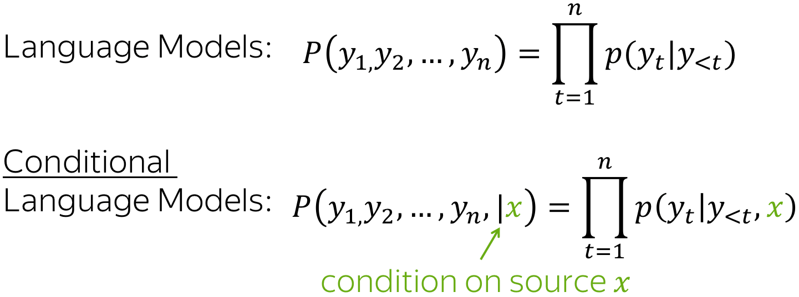

# 序列到序列模型

在开始学习本篇内容前先通过一个视频简单了解下序列到序列（Seq2Seq）模型的基本概念。

  <iframe width="100%" height="400" src="https://www.bilibili.com/video/BV1Ak4y117P3?vd_source=4637c70bef5449098d67281879acd7eb&p=43&autoplay=0" 
    title="C5W3L01 Basic Models_哔哩哔哩_bilibili" 
    frameborder="0" 
    allow="clipboard-write; encrypted-media; picture-in-picture" 
    allowfullscreen>
  </iframe>

!!! info "文档来源"
    本文档改编自 Lena Voita 的 [NLP Course | Sequence to Sequence (seq2seq) and Attention](https://lena-voita.github.io/nlp_course/seq2seq_and_attention.html)。
    
    原作者：[Lena Voita](https://lena-voita.github.io/)

最流行的序列到序列任务是翻译：通常是从一种自然语言到另一种自然语言。在过去几年中，商业系统在机器翻译方面取得了惊人的进步 —— 你可以体验以下几个系统：

{: align=right style="max-width:70%; margin-left:20px;"}

- [Google 翻译](https://translate.google.com)
- [Yandex 翻译](https://translate.yandex.com)
- [DeepL 翻译器](https://www.deepl.com/en/translator)
- [必应微软翻译](https://www.bing.com/translator)

在这篇笔记中我们将学习这些系统的基本结构-序列到序列模型架构。

除了常见的自然语言之间的机器翻译，你还可以在编程语言之间进行翻译（参见 Facebook AI 博客文章 [Deep learning to translate between programming languages](https://ai.facebook.com/blog/deep-learning-to-translate-between-programming-languages/)），或者在任何你能想到的标记序列之间进行翻译。从现在开始，我们用**机器翻译**来表示任何一般的序列到序列任务，即在任何性质的标记序列之间进行翻译。

## 序列到序列基础
形式上，在机器翻译任务中，我们有一个输入序列 $x_1, x_2, \dots, x_m$ 和一个输出序列 $y_1, y_2, \dots, y_n$（注意它们的长度可以不同）。翻译可以被看作是寻找给定输入后最可能的目标序列；形式上，就是寻找使条件概率 $p(y|x)$ 最大化的目标序列：$y^{\ast}=\arg\max\limits_{y}p(y|x)$。

如果你是双语者，能够轻松地在语言之间进行翻译，你对 $p(y|x)$ 会有一种直观的感觉，可以说类似 "这个翻译对这个句子来说更自然" 这样的话。但在机器翻译中，我们学习一个带有参数 $\theta$ 的函数 $p(y|x, \theta)$，然后为给定输入找到其最大值：$y'=\arg\max\limits_{y}p(y|x, \theta)$。

要定义一个机器翻译系统，我们需要回答三个问题：

- **建模** - 模型 $p(y|x, \theta)$ 是什么样的？
- **学习** - 如何找到参数 $\theta$？
- **推理** - 如何找到最佳的 $y$？

在本讲中，我们将完整回答第二和第三个问题，但只考虑最简单的模型。更 "真实" 的模型将在后面的[注意力机制](attention.md)和 [Transformer](transformer.md) 部分中讨论。

## 编码器-解码器框架

{: align=right style="max-width:60%; margin-left:20px;"}

编码器-解码器（Encoder-Decoder）是序列到序列任务的标准建模范式。这个框架包含两个组件：

- **编码器** - 读取源序列并生成其表示；
- **解码器** - 使用编码器生成的源表示来生成目标序列。

本讲及后续几讲中，我们将看到不同的序列到序列模型，它们都基于编码器-解码器这种结构。

## 条件语言模型

**语言模型**（能够根据给定的文本上下文，预测并生成合适的后续文本）估计的是标记序列 $y=(y_1, y_2, \dots, y_n)$ 的**无条件**概率 $p(y)$，而**序列到序列模型**需要估计给定源序列 $x$ 后序列 $y$ 的**条件**概率 $p(y|x)$。这就是为什么序列到序列任务可以被建模为**条件语言模型（CLM）** —— 它们的操作方式与语言模型类似，但额外接收源信息 $x$。

{: style="max-width:60%; display: block; margin:20px auto"}

!!! note "Lena 说"
    注意，条件语言建模不仅仅是解决序列到序列任务的一种方式。从最一般的意义上说，$x$ 可以是标记序列以外的其他东西。例如，在图像描述任务中，$x$ 是一张图像，而 $y$ 是这张图像的描述。

<video controls loop style="width:90%; display: block; margin:20px auto">
  <source src="./images/seq2seq/enc_dec_prob_idea.mp4" type="video/mp4">
</video>

序列到序列模型与语言模型的唯一区别仅是源序列 $x$ 的存在，所以它的建模和训练与语言模型非常相似。概括来说，总体流程如下：

- 将源序列和之前生成的目标词输入网络；
- 从网络解码器获取上下文的向量表示（包括源序列和之前的目标）；
- 从这个向量表示预测下一个标记的概率分布。

与语言模型类似，我们可以用一种非常简单的方式来思考分类部分（即如何从文本的向量表示获得标记概率）。文本的向量表示具有某个维度 $d$，但最终我们需要一个大小为 $|V|$ 的向量（$|V|$ 个标记/类的概率）。要从 $d$ 维向量得到 $|V|$ 维向量，我们可以使用一个线性层。一旦我们有了 $|V|$ 维向量，剩下的就是应用 softmax 操作将原始数字转换为标记概率。

## 最简单的模型：使用两个 RNN 作为编码器和解码器

最简单的编码器-解码器模型由两个 RNN（LSTM）组成：一个用于编码器，另一个用于解码器。编码器 RNN 读取源句子，其最终状态被用作解码器 RNN 的初始状态。我们希望最终的编码器状态能够"编码"源句子的所有信息，解码器可以基于这个向量生成目标句子。

这个模型可以有不同的修改：例如，编码器和解码器可以有多个层。这样一个多层模型在论文 [Sequence to Sequence Learning with Neural Networks](https://arxiv.org/pdf/1409.3215.pdf) 中被使用 —— 这是使用神经网络解决序列到序列任务的最早尝试之一。

在同一篇论文中，作者观察了最后的编码器状态并可视化了几个例子（如下图所示）。有趣的是，具有相似含义但不同结构的句子的表示是接近的！

{: style="display: block; margin: 20px auto"}
*示例来自论文 [Sequence to Sequence Learning with Neural Networks](https://arxiv.org/pdf/1409.3215.pdf)*

!!! tip "提示"
    论文 [Sequence to Sequence Learning with Neural Networks](https://arxiv.org/pdf/1409.3215.pdf) 引入了一个优雅的技巧来使这种简单的 LSTM 模型工作得更好。在"研究思考"部分的练习中可以了解更多。

## 训练：使用交叉熵损失

与神经网络语言模型类似，神经网络序列到序列模型被训练来预测下一个标记（next token）的概率分布，给定前面的上下文（源和之前的目标标记）。直观地说，在每一步我们都要最大化模型给正确标记赋予的概率。

形式上，假设我们有一个训练实例，源序列为 $x=(x_1, \dots, x_m)$，目标序列为 $y=(y_1, \dots, y_n)$。那么在时间步 $t$，模型预测概率分布 $p^{(t)} = p(\ast|y_1, \dots, y_{t-1}, x_1, \dots, x_m)$。

这一步的目标是 $p^{\ast}=\text{one-hot}(y_t)$，即我们希望模型对正确的标记 $y_t$ 赋予概率 1，对其他标记赋予概率 0。

标准损失函数是**交叉熵损失**。对于目标分布 $p^{\ast}$ 和预测分布 $p^{}$，交叉熵损失为：

$$Loss(p^{\ast}, p^{})= - p^{\ast} \log(p) = -\sum\limits_{i=1}^{|V|}p_i^{\ast} \log(p_i)$$

由于只有一个 $p_i^{\ast}$ 非零（对应正确标记 $y_t$），我们得到：

$$Loss(p^{\ast}, p) = -\log(p_{y_t})=-\log(p(y_t| y_{\text{<}t}, x))$$

在每一步，我们最大化模型对正确标记赋予的概率。下图展示了单个时间步的情况：

{: style="display: block; margin: 20px auto"}

对于整个例子，损失将是 $-\sum\limits_{t=1}^n\log(p(y_t| y_{\text{<}t}, x))$。下面的动画展示了训练过程（虽然动画展示的是 RNN 模型，但模型可以是不同的）。

<video controls loop style="width:100%; display: block; margin: 20px auto">
  <source src="./images/seq2seq/seq2seq_training_with_target.mp4" type="video/mp4">
</video>

## 推理：贪婪解码和集束搜索

现在我们理解了模型可能的样子以及如何训练这个模型，让我们思考如何使用这个模型生成翻译。我们这样建模句子的概率：

{: style="max-width:80%; display: block; margin: 20px auto"}

现在的主要问题是：如何找到 argmax？

注意，**我们无法找到精确解**。我们需要检查的假设总数是 $|V|^n$，这在实践中是不可行的。因此，我们将寻找一个近似解。

!!! note "Lena 说"
    实际上，精确解通常比我们将要使用的近似解更差。

### 贪婪解码

最直接的解码策略是贪婪的 —— 在每一步生成概率最高的标记。这可以作为一个好的基线，但这种方法本质上是有缺陷的：当前步骤最好的标记不一定会导致最好的序列。

{: style="max-width:60%; display: block; margin: 20px auto"}

### 集束搜索

作为替代，我们可以同时跟踪几个最可能的假设。在每一步，我们将继续每个当前假设并选择其中的前 N 个。这就是所谓的**集束搜索 （Beam Search）**。

<video controls loop style="width:80%; display: block; margin: 20px auto">
  <source src="./images/seq2seq/beam_search.mp4" type="video/mp4">
</video>

通常，集束大小为 4-10。增加集束大小在计算上效率低下，更重要的是，会导致更差的质量。