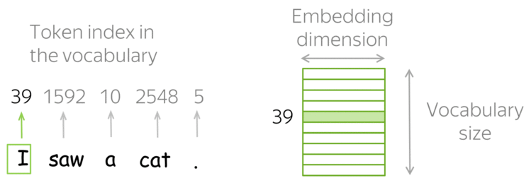
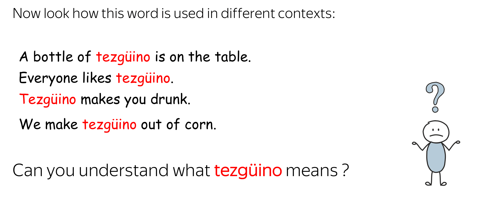
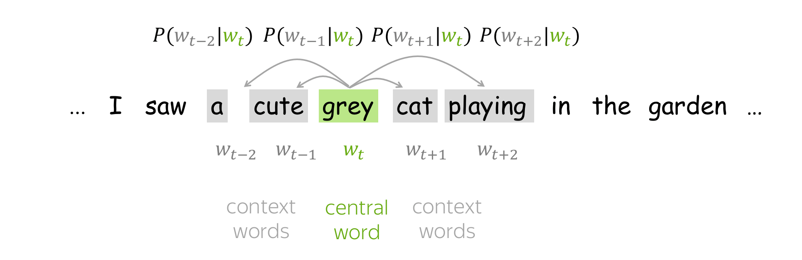
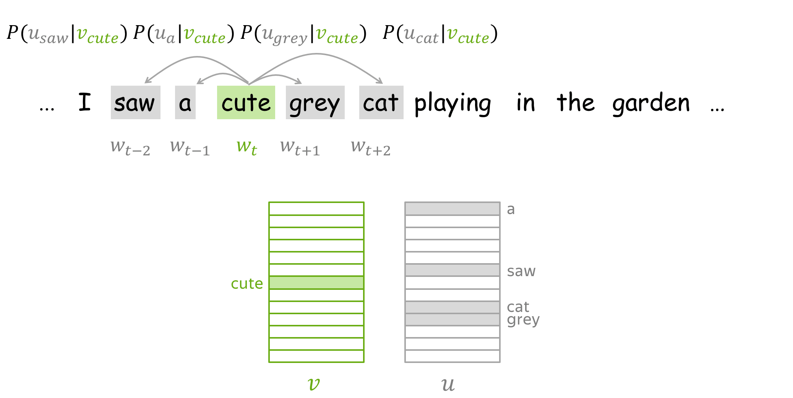
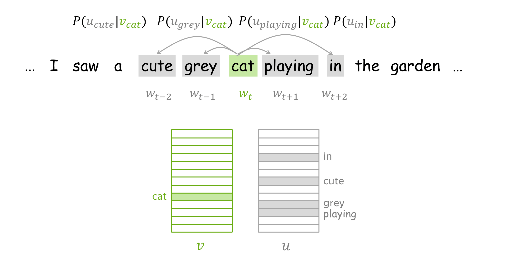

# 词向量/词嵌入

!!! info "文档来源"
    本文档改编自 Lena Voita 的 [NLP Course | Word Embeddings](https://lena-voita.github.io/nlp_course/word_embeddings.html)。
    
    原作者：[Lena Voita](https://lena-voita.github.io/)

词向量/词嵌入（Word Embeddings）是机器学习模型理解文本数据的基础。

机器学习模型 "看到" 数据的方式与我们人类不同。例如, 我们可以轻松理解文本 "I saw a cat", 但我们的模型不能 - 它们需要特征向量。这些向量, 或称为词嵌入, 是可以输入到模型中的词的表示。

 

<u>工作原理</u>: 查找表 (词汇表)

实践中, 你需要预先选择一个允许使用的词汇表。对于词汇表中的每个词, 查找表都包含其嵌入。可以使用词在词汇表中的索引找到这个嵌入 (即通过词索引在表中 "查找" 嵌入)。

{: style="width: 300px; display: block; margin: 0 auto;"}

为了处理未知词 (不在词汇表中的词), 词汇表通常包含一个特殊的标记 `UNK`。或者,未知标记可以被忽略或赋予零向量。

<h2 style="font-size: 1.2em">本讲的主要问题是: 我们如何获得这些词向量?</h2>

## 离散符号表示: One-hot 向量

{: style="width: 300px; display: block; margin: 0 auto;"}

最简单的方法是将词表示为 **one-hot 向量**: 对于词汇表中的第i个词,向量在第i维上为1,其余维度为0。在机器学习中,这是表示类别特征最简单的方式。

你可能已经猜到为什么 one-hot 向量不是表示词的最佳方式。一个问题是对于大型词汇表, 这些向量会非常长: 向量维度等于词汇表大小。这在实践中是不理想的, 但这不是最关键的问题。

真正重要的是, 这些向量 "不了解" 它们所表示的词。例如, one-hot 向量认为 "cat" 与 "dog" 的距离与它和 "table" 的距离相同! 我们可以说 **one-hot 向量无法捕获 "含义"**。

<h2 style="font-size: 1.2em">但我们如何知道什么是含义呢?</h2>

## 分布式语义

为了在向量中捕获词的含义, 我们首先需要定义一个可以在实践中使用的含义概念。为此, 让我们试着理解我们人类是如何知道哪些词具有相似含义的。

!!! info "提示"
    按照自己的节奏浏览幻灯片。试着注意你的大脑是如何工作的。

<!-- 引入 Flickity CSS 和 JS -->
<link rel="stylesheet" href="assets/flickity.min.css">

    

        
    

    

        
    

    

        
    

    

        
    

    

        
    

    

        
    

    

        
    

    

        
    

    

        
    

一旦你看到这个未知词在不同上下文中的使用方式, 你就能理解它的含义。这点是如何做到的呢?

假设是你的大脑检索到了可以在相同上下文中使用的其他词, 找到了一些近义词如 "wine", 并得出结论认为 "tezgüino" 与这些词具有相似的含义。

这就是分布假说:

> **经常出现在相似上下文中的词具有相似的含义。**

这是一个极其有价值的想法: 它可以在实践中用于使词向量捕获它们的含义。根据分布假说, "捕获含义" 和 "捕获上下文" 本质上是一样的。因此, 我们需要做的就是将有关词的上下文的信息放入词的表示中。

> **主要思想：我们需要将有关词的上下文的信息放入词的表示中。**

本讲的剩余部分将探讨实现这一目标的不同方法。

## 基于计数的方法

让我们回顾一下主要思想：

>**我们必须将上下文信息放入词向量中。**

基于计数的方法相当直接地实现了这一思想：

>**基于全局语料库统计手动添加这些信息。**

上图展示了一般过程，包括两个步骤：
1. 构建共现矩阵； 
2. 降维以获得最终的词向量。 

降维有两个原因：首先，原始矩阵非常大；其次，由于许多词只出现在少数可能的上下文中，这个矩阵可能包含大量无信息的元素（如零值）。

要估计词/上下文之间的相似度，通常需要计算归一化词/上下文向量的点积（即余弦相似度）。

{: style="width: 25%; float: right; margin-left: 30px;"}

要定义一个基于计数的方法，我们需要确定两件事：

- 可能的上下文（包括如何定义一个词出现在上下文中）；
- 关联度的概念，即计算矩阵元素的公式。

下面我们介绍几种常用的方法。

### 简单方法：共现计数

{: style="width: 65%; float: left; margin-bottom: 10px;"}
{: style="width: 30%; float: right; margin-left: 20px; margin-top: 0px;"}

最简单的方法是将上下文定义为 L 大小窗口内的每个词。对于词-上下文对 (w, c)，矩阵元素是 w 出现在上下文 c 中的次数。这是一种非常基础（也非常古老）的获取词嵌入的方法。

!!! info "提示"
    著名的 HAL 模型（1996）也是这种方法的一个变体。在 "研究思考" 部分的练习中可以了解更多。

### 正向点互信息（Positive Pointwise Mutual Information, PPMI）

{: style="width: 45%; float: right; margin-left: 20px;"}

这里上下文的定义与之前相同，但词和上下文之间关联的度量更加巧妙：使用正向点互信息（简称 PPMI）。

PPMI 度量被广泛认为是神经网络之前的分布相似度模型的最佳方法。

!!! important "重要提示：与神经网络模型的关系！"
    事实证明，我们后面要讨论的一些神经网络方法（Word2Vec）实际上是在隐式地近似（移位的）PMI 矩阵的分解。

### 潜在语义分析（LSA）：理解文档

{: style="width: 60%; float: right; margin-left: 20px;"}

[潜在语义分析（LSA）](http://lsa.colorado.edu/papers/JASIS.lsi.90.pdf)分析文档集合。与之前的方法不同，在之前的方法中上下文仅用于获取词向量并在之后被丢弃，而这里我们也对上下文（在这种情况下是文档）向量感兴趣。LSA 是最简单的主题模型之一：文档向量之间的余弦相似度可用于衡量文档之间的相似度。

"LSA" 有时指代一种更一般的方法：对词-文档矩阵应用 SVD，其中词-文档元素可以通过不同方式计算（如简单共现、tf-idf 或其他权重）。

!!! tip "动画提示"
    [LSA 的维基百科页面](https://en.wikipedia.org/wiki/Latent_semantic_analysis)有一个很好的文档-词矩阵主题检测过程的动画 - 快去看看！

## Word2Vec：基于预测的方法

### 主要思想

让我们再次回顾主要思想：

>**我们必须将上下文信息放入词向量中。**

Word2Vec 以不同的方式使用这个思想：

>**通过教会词向量预测上下文来学习它们。**

{: style="width: 60%; float: right; margin-left: 20px;"}

Word2Vec 是一个参数为词向量的模型。这些参数通过迭代优化特定目标函数来学习。该目标函数强制词向量 "了解" 词可能出现的上下文：向量被训练来预测相应词的可能上下文。正如你从分布假说中记得的，如果向量 "了解" 上下文，它们就 "了解" 词义。

Word2Vec 是一种迭代方法。其主要思想如下：

- 使用大规模文本语料库；
- 用滑动窗口逐词遍历文本。每一步都有一个中心词和上下文词（窗口中的其他词）；
- 对于中心词，计算上下文词的概率；
- 调整向量以增加这些概率。

 
通过下面的插图理解一下主要思想：

    

        
    

    

        
    

    

        
    

    

        
    

    

        
    

    

        
    

[斯坦福 CS224n 课程](http://web.stanford.edu/class/cs224n/index.html#schedule)提供的可视化思路。
{: style="font-size: 14px; text-align: center"} 

### 目标函数：负对数似然

对于文本语料库中的每个位置 \(t =1, \dots, T\)，Word2Vec 根据中心词 \(\color{#88bd33}{w_t}\) 预测 m 大小窗口内的上下文词：

\[\color{#88bd33}{\mbox{似然}} \color{black}= L(\theta)= \prod\limits_{t=1}^T\prod\limits_{-m\le j \le m, j\neq 0}P(\color{#888}{w_{t+j}}|\color{#88bd33}{w_t}\color{black}, \theta), \]

其中 \(\theta\) 是所有需要优化的变量。

目标函数（也称损失函数或代价函数）\(J(\theta)\) 是平均负对数似然：

{: style="width: 90%; margin-bottom: 10px;"}

注意损失函数如何与我们上面的计划相吻合：用滑动窗口遍历文本并计算概率。现在让我们看看如何计算这些概率。

{: style="width: 60%; float: right; margin-left: 25px;"}

**如何计算 \(P(\color{#888}{w_{t+j}}\color{black}|\color{#88bd33}{w_t}\color{black}, \theta)\)?**

对于每个词 w，我们将有两个向量：

- \(\color{#88bd33}{v_w}\)：当它是中心词时
- \(\color{#888}{u_w}\)：当它是上下文词时

 训练完成后，通常会丢弃上下文向量，只使用词向量。

对于中心词 \(\color{#88bd33}{c}\)（c - central）和上下文词 \(\color{#888}{o}\)（o - outside word），上下文词的概率为：

{: style="margin: 10px;"}

??? note "softmax 函数在此！"
    $$
    \text{softmax}(x_i) = \frac{\exp(x_i)}{\sum_{j=1}^{n}\exp(x_j)}
    $$ 
    {: style="text-align: center; font-size: 24px;"}

softmax 函数将任意值 \(x_i\) 映射到概率分布 \(p_i\)：

- "max"：因为最大的 \(x_i\) 将有最大的概率 \(p_i\)；
- "soft"：因为所有概率都非零。

通过下面的插图来理解一下。注意对于中心词和上下文词，我们使用了不同的向量。例如，一开始单词 **a** 是中心词，我们使用 \(\color{#88bd33}{v_a}\)，但当它成为上下文时，我们使用 \(\color{#888}{u_a}\) 代替。

    

        
    

    

        
    

    

        
    

    

        
    

    

        
    

    

        
    

### 如何训练：使用梯度下降，一次一词

让我们回顾一下，我们的参数 \(\theta\) 是词汇表中所有词的向量 \(\color{#88bd33}{v_w}\) 和 \(\color{#888}{u_w}\)。这些向量通过梯度下降优化训练目标来学习（使用学习率 \(\alpha\)）：

\[\theta^{new} = \theta^{old} - \alpha \nabla_{\theta} J(\theta).\]

<h2 style="font-size: 1.2em; font-weight: bold;">一次一词</h2>

我们一次进行一个更新：每次更新针对一个中心词和它的一个上下文词对。再看一下损失函数：

\[\color{#88bd33}{\mbox{Loss}}\color{black} =J(\theta)= -\frac{1}{T}\log L(\theta)=
-\frac{1}{T}\sum\limits_{t=1}^T
\sum\limits_{-m\le j \le m, j\neq 0}\log P(\color{#888}{w_{t+j}}\color{black}|\color{#88bd33}{w_t}\color{black}, \theta)=
\frac{1}{T} \sum\limits_{t=1}^T
\sum\limits_{-m\le j \le m, j\neq 0} J_{t,j}(\theta). \]

对于中心词 \(\color{#88bd33}{w_t}\)，损失函数包含了每个上下文词 \(\color{#888}{w_{t+j}}\) 对应的独立项 \(J_{t,j}(\theta)=-\log P(\color{#888}{w_{t+j}}\color{black}|\color{#88bd33}{w_t}\color{black}, \theta)\)。

让我们详细看一下这个项，并试图理解如何进行这一步的更新。例如，假设我们有一个句子：

{: style="max-width:70%"}

其中中心词是 cat，有四个上下文词。
由于我们只看一步，我们只选择其中一个上下文词；例如，让我们选择 cute。

那么，中心词 cat 和上下文词 cute 的损失项为：

\[ J_{t,j}(\theta)= -\log P(\color{#888}{cute}\color{black}|\color{#88bd33}{cat}\color{black}) =
    -\log \frac{\exp\color{#888}{u_{cute}^T}\color{#88bd33}{v_{cat}}}{
   \sum\limits_{w\in Voc}\exp{\color{#888}{u_w^T}\color{#88bd33}{v_{cat}} }} =
-\color{#888}{u_{cute}^T}\color{#88bd33}{v_{cat}}\color{black}
    + \log \sum\limits_{w\in Voc}\exp{\color{#888}{u_w^T}\color{#88bd33}{v_{cat}}}\color{black}{.}
    \]

注意在这一步中存在的参数：

- 中心词向量中，只有 \(\color{#88bd33}{v_{cat}}\)；
- 上下文词向量中，包含所有 \(\color{#888}{u_w}\)（词汇表中的所有词）。

只有这些参数会在当前步骤中被更新。

下面是这一步推导的示意图：

{: style="max-width:90%"}

{: style="float:right; margin-left: 25px; max-width:60%"}

通过最小化 \(J_{t,j}(\theta)\) 进行更新，我们强制参数增加 \(\color{#88bd33}{v_{cat}}\) 和 \(\color{#888}{u_{cute}}\) 的相似度（点积），同时减少 \(\color{#88bd33}{v_{cat}}\) 与词汇表中所有其他词 \(\color{#888}{u_{w}}\) 的相似度。

这可能听起来有点奇怪：为什么我们要减少 \(\color{#88bd33}{v_{cat}}\) 与所有其他词的相似度，如果其中一些也是有效的上下文词（例如，我们例句中的 grey、playing、in）？

但不用担心：因为我们对每个上下文词（以及文本中的所有中心词）都进行更新，在所有更新的平均效果下，我们的向量将学习到可能的上下文分布。

!!! question "练习"
    尝试推导上述插图最后一步里的梯度。
    如果遇到困难，可以参考论文 [Word2Vec Parameter Learning Explained](https://arxiv.org/pdf/1411.2738.pdf)。

### 更快的训练：负采样

在上面的例子中，对于每一对中心词和上下文词，我们都需要更新所有上下文词的向量。这是非常低效的：每一步所需的更新时间与词汇表大小成正比。

但为什么我们在每一步都要考虑词汇表中的所有上下文向量呢？
例如，想象在当前步骤中，我们不考虑所有词的上下文向量，而只考虑当前目标词（cute）和几个随机选择的词。下图展示了这个直观想法：

{: style="max-width:90%"}

和之前一样，我们增加 \(\color{#88bd33}{v_{cat}}\) 和 \(\color{#888}{u_{cute}}\) 之间的相似度。不同的是，现在我们减少 \(\color{#88bd33}{v_{cat}}\) 与上下文向量的相似度时，不是对所有词，而只是对 K 个"负样本"的子集。

由于我们有大量语料库，在所有更新的平均效果下，我们会对每个向量进行足够次数的更新，向量仍然能够很好地学习词之间的关系。

形式上，这一步的新损失函数为：
$$ J_{t,j}(\theta)=
-\log\sigma(\color{#888}{u_{cute}^T}\color{#88bd33}{v_{cat}}\color{black}) -
\sum\limits_{w\in \{w_{i_1},\dots, w_{i_K}\}}\log\sigma({-\color{#888}{u_w^T}\color{#88bd33}{v_{cat}}}\color{black}),
$$

其中， \(w_{i_1},\dots, w_{i_K}\) 是在这一步选择的 K 个负样本，\(\sigma(x)=\frac{1}{1+e^{-x}}\) 是 sigmoid 函数。

注意到 \(\sigma(-x)=\frac{1}{1+e^{x}}=\frac{1\cdot e^{-x}}{(1+e^{x})\cdot e^{-x}} =
\frac{e^{-x}}{1+e^{-x}}= 1- \frac{1}{1+e^{x}}=1-\sigma(x)\)。因此损失函数也可以写作：

$$ J_{t,j}(\theta)=
-\log\sigma(\color{#888}{u_{cute}^T}\color{#88bd33}{v_{cat}}\color{black}) -
\sum\limits_{w\in \{w_{i_1},\dots, w_{i_K}\}}\log(1-\sigma({\color{#888}{u_w^T}\color{#88bd33}{v_{cat}}}\color{black})).
$$

!!! question "练习"
    使用负采样时，梯度和更新是如何变化的？

<h2 style="font-size: 1.2em; font-weight: bold;">负样本的选择</h2>

每个词只有少数几个 "真实" 上下文。因此，随机选择的词很可能是"负面的"，即不是真实的上下文。这个简单的想法不仅用于高效训练 Word2Vec，也用于许多其他应用，我们将在课程后面看到其中的一些。

Word2Vec 基于词的经验分布随机采样负样本。令 \(U(w)\) 为词的一元分布，即 \(U(w)\) 是词 \(w\) 在文本语料库中的频率。Word2Vec 修改这个分布以更频繁地采样低频词：采样概率与 \(U^{3/4}(w)\) 成正比。

### Word2Vec 变体：Skip-Gram 和 CBOW

Word2Vec 有两种变体：Skip-Gram 和 CBOW。

Skip-Gram 就是我们目前考虑的模型：给定中心词预测上下文词。带负采样的 Skip-Gram 是最流行的方法。

CBOW（Continuous Bag-of-Words，连续词袋模型）从上下文向量的和预测中心词。这种简单的词向量求和被称为"词袋"，这也是模型名称的由来。

{: style="max-width:90%"}

!!! question "练习"
    CBOW 模型的损失函数和梯度是如何变化的？
    如果遇到困难，可以参考论文 [Word2Vec Parameter Learning Explained](https://arxiv.org/pdf/1411.2738.pdf)。

### 补充说明

Word2Vec 的原始论文是：

- [Efficient Estimation of Word Representations in Vector Space](https://arxiv.org/pdf/1301.3781.pdf)
- [Distributed Representations of Words and Phrases and their Compositionality](https://papers.nips.cc/paper/5021-distributed-representations-of-words-and-phrases-and-their-compositionality.pdf)

你可以查看这些论文了解实验、实现和超参数的详细信息。这里我们将提供一些你需要知道的最重要的内容。

<h2 style="font-size: 1.2em; font-weight: bold;">这个想法并不新颖</h2>

学习词向量（分布式表示）的想法并不新颖。例如，之前就有尝试将词向量作为更大网络的一部分来学习，然后提取嵌入层。（关于之前方法的详细信息，你可以查看原始 Word2Vec 论文中的总结）。

令人意外的是，Word2Vec 能够在巨大的数据集上非常快速地学习高质量的词向量，而且可以处理大型词汇表。当然，我们将在"分析与可解释性"部分看到的所有有趣特性也很快使 Word2Vec 变得非常著名。

<h2 style="font-size: 1.2em; font-weight: bold;">为什么使用两个向量？</h2>

如你所记得的，在 Word2Vec 中我们为每个词训练两个向量：一个用于中心词，另一个用于上下文词。训练后，上下文向量会被丢弃。

这是使 Word2Vec 如此简单的技巧之一。再看一下损失函数（一个步骤）：

$$ J_{t,j}(\theta)= -\color{#888}{u_{cute}^T}\color{#88bd33}{v_{cat}}\color{black} - 
\log \sum\limits_{w\in V}\exp{\color{#888}{u_w^T}\color{#88bd33}{v_{cat}}}\color{black}{.} $$

当中心词和上下文词有不同的向量时，第一项和指数内的点积都对参数是线性的（对于负采样训练目标也是如此）。因此，梯度计算很容易。

!!! question "练习"
    推导每个词只有一个向量的情况下的损失和梯度（\(\forall w \ in \ V, \color{#88bd33}{v_{w}}\color{black}{ = }\color{#888}{u_{w}}\)）。

!!! note "注意"
    虽然标准做法是丢弃上下文向量，但研究表明平均词向量和上下文向量可能更有益。具体可参考：

    - [Neural Word Embedding
    as Implicit Matrix Factorization](https://proceedings.neurips.cc/paper_files/paper/2014/file/feab05aa91085b7a8012516bc3533958-Paper.pdf) (Omer Levy, Yoav Goldberg)
    - [Improving Distributional Similarity
    with Lessons Learned from Word Embeddings](https://aclanthology.org/Q15-1016.pdf) (Omer Levy, Yoav Goldberg, Ido Dagan)

<h2 style="font-size: 1.2em; font-weight: bold;">更好的训练</h2>

!!! tip "提示"
    还有一个技巧：在 "研究思考" 部分的[这个练习](#research_better_training)中可以了解更多。

<h2 style="font-size: 1.2em; font-weight: bold;">与 PMI 矩阵分解的关系</h2>

!!! important "重要"
    Word2Vec SGNS（带负采样的 Skip-Gram）实际上是在隐式地近似（移位的）PMI 矩阵的分解。[了解更多](https://proceedings.neurips.cc/paper_files/paper/2014/file/feab05aa91085b7a8012516bc3533958-Paper.pdf)。

<h2 style="font-size: 1.2em; font-weight: bold;">窗口大小的影响</h2>

窗口大小对结果向量的相似性有很大影响。例如，[这篇论文](https://arxiv.org/pdf/1510.00726.pdf)指出：

- 较大的窗口倾向于产生更多主题相似性（如 **dog**、**bark** 和 **leash** 会被分在一起，**walked**、**run** 和 **walking** 也是）；
- 较小的窗口倾向于产生更多功能和语法相似性（如 **Poodle**、**Pitbull**、**Rottweiler**，或 **walking**、**running**、**approaching**）。

<h2 style="font-size: 1.2em; font-weight: bold;">（相对）标准的超参数</h2>

超参数的选择通常取决于具体任务；你可以查看原始论文了解更多细节。

相对标准的设置是：

- **模型**：带负采样的 Skip-Gram；
- **负样本数量**：对于较小的数据集，15-20个；对于通常使用的巨大数据集，可以是2-5个；
- **嵌入维度**：常用值是300，但其他变体（如100或50）也是可能的。关于最优维度的理论解释，请查看"相关论文"部分；
- **滑动窗口（上下文）大小**：5-10。

## GloVe：词表示的全局向量

{: style="max-width:90%"}

[GloVe 模型](https://www.aclweb.org/anthology/D14-1162.pdf)是计数方法和预测方法（如 Word2Vec）的结合。模型名称 GloVe 代表 "Global Vectors"（全局向量），这反映了它的思想：该方法使用语料库中的全局信息来学习向量。

如我们之前所见，最简单的计数方法使用共现计数来衡量 词 **w** 和 上下文 **c** 之间的关联：N(w, c)。

GloVe 也使用这些计数来构建损失函数：

{: style="max-width:80%"}

与 Word2Vec 类似，我们也有不同的向量用于中心词和上下文词 - 这些是我们的参数。此外，该方法为每个词向量都有一个标量偏置项。

特别有趣的是 GloVe 控制罕见词和频繁词影响的方式：每对 (w, c) 的损失都经过加权，使得：

- 罕见事件被惩罚；
- 非常频繁的事件不会被过度加权。

!!! note "Lena 说"
    损失函数本身看起来很合理，但[原始 GloVe 论文](https://www.aclweb.org/anthology/D14-1162.pdf)有非常好的推导过程得出上述公式。我在这里就不详细介绍了（我总得在某个时候结束讲座，对吧？..），但你可以自己阅读 - 真的非常非常精彩！

## 词嵌入的评估

如何判断一种词嵌入方法比另一种更好？有两种类型的评估（不仅适用于词嵌入）：内在评估和外在评估。

<h2 style="font-size: 1.2em; font-weight: bold;">内在评估：基于内部属性</h2>
{: style="float:right; margin-left: 25px; max-width:60%"}

这种评估方法关注嵌入的内部属性，即它们捕捉语义的能力。具体来说，在 "分析与可解释性" 部分，我们将详细讨论如何在词相似性和词类比任务上评估嵌入。

<h2 style="font-size: 1.2em; font-weight: bold;">外在评估：在实际任务中</h2>
{: style="float:right; margin-left: 25px; max-width:60%"}

这种评估方法告诉我们哪些嵌入对你真正关心的任务（如文本分类、指代消解等）更有效。

在这种设置下，你需要多次训练实际任务的模型/算法：每种要评估的嵌入都需要训练一个模型。然后，通过查看这些模型的质量来决定哪种嵌入更好。

<h2 style="font-size: 1.2em; font-weight: bold;">如何选择？</h2>
{: style="float:right; margin-left: 25px; max-width:60%"}

你必须习惯的一点是：没有完美的解决方案，也没有适用于所有情况的正确答案：这总是取决于很多因素。

关于评估，你通常关心要解决的任务的质量。因此，你可能会更关注外在评估。然而，实际任务的模型通常需要大量时间和资源来训练，训练多个模型可能成本太高。

**Anyway，决定权在你！**

## 分析与可解释性

!!! note "Lena 说"
    对于词嵌入，这部分的大多数内容通常被视为评估（内在评估）。然而，由于查看模型学到了什么（超出特定任务指标）是人们通常在分析中做的事情，我认为它可以在这里，在分析部分呈现。

<h2 style="font-size: 1.2em; font-weight: bold;">在语义空间中漫步！</h2>

语义空间旨在创建能够捕捉含义的自然语言表示。我们可以说（好的）词嵌入形成了语义空间，并将多维空间中的词向量集合称为"语义空间"。

下面展示的是在 twitter 数据上训练的 GloVe 向量形成的语义空间（来自 [gensim](https://github.com/RaRe-Technologies/gensim-data)）。向量使用 t-SNE 投影到二维空间；这里只显示了最频繁的前 3000 个词。

!!! tip "如何操作"
    在语义空间中漫步，试着找找：

    - 语言聚类：西班牙语、阿拉伯语、俄语、英语。你能找到更多语言吗？
    - 以下内容的聚类：食物、家庭、名字、地理位置。你还能找到什么？

<iframe frameborder="0" width="510" height="510" scrolling="no" src="https://lena-voita.github.io/resources/lectures/word_emb/analysis/glove100_twitter_top3k.html">
</iframe>

<h2 style="font-size: 1.2em; font-weight: bold;">最近邻居</h2>

在语义空间中漫步时，你可能注意到相近的点（向量）通常具有相近的含义。有时，即使是罕见词也能被很好地理解。看看这个例子：模型理解了 **leptodactylidae** 或 **litoria** 这样的词与 **frog** 很接近。

    
    

        上图示例来自 <a href="https://nlp.stanford.edu/projects/glove/">GloVe 项目页面</a>
    

<h3 style="font-size: 1.1em;">词相似性基准</h3>

"查看" 最近邻居（通过余弦相似度或欧氏距离）是评估学习到的嵌入质量的方法之一。有几个词相似性基准（测试集）。它们由带有人工判断相似度分数的词对组成。嵌入的质量通过模型和人类给出的两个相似度分数之间的相关性来估计。

    
    

        来自 <a href="https://nlp.stanford.edu/~lmthang/data/papers/conll13_morpho.pdf">Rare Words 相似性基准</a> 的几个词对示例
    

<h2 style="font-size: 1.2em; font-weight: bold;">线性结构</h2>

虽然相似性结果令人鼓舞，但这并不令人惊讶：毕竟，嵌入就是专门训练来反映词的相似性的。令人惊讶的是，词向量空间中的许多语义和语法关系都是（几乎）线性的。

{: style="float:right; width: 50%; margin-left: 20px; margin-top: 10px;"}

例如，**king** 和 **queen** 之间的差异与 **man** 和 **woman** 之间的差异（几乎）相同。或者说，与 **queen** 相似的词，其相似方式与 **kings** 之于 **king** 的方式相同，结果就是 **queens**。

**man-woman** \(\approx\) **king-queen** 的例子可能是最流行的一个，但还有许多其他关系和有趣的例子。

下面是国家-首都关系和一些语法关系的例子：

{: style="width: 100%"}

!!! note "重要论文"
    在 ICML 2019 上，研究人员展示了 Word2Vec 中类比关系的理论。具体可见论文 [Analogies Explained: Towards Understanding Word Embeddings](https://arxiv.org/pdf/1901.09813.pdf)。

<h3 style="font-size: 1.1em;">词类比基准</h3>

这些近似线性关系启发了一种新的评估方式：词类比评估。

{: style="width: 90%"}

给定同一关系的两对词，例如 **(man, woman)** 和 **(king, queen)**，任务是检查我们是否能基于其余词来识别其中一个词。具体来说，我们需要检查与 **king - man + woman** 最接近的向量是否对应于词 **queen**。

现在有几个类比基准，包括标准基准（[MSR](https://www.aclweb.org/anthology/N13-1090.pdf) + [Google 类比](https://arxiv.org/pdf/1301.3781.pdf)测试集）和 [BATS（更大的类比测试集）](https://www.aclweb.org/anthology/N16-2002.pdf)。

    
    

        来自 <a href="https://arxiv.org/pdf/1301.3781.pdf">Google 类比测试集</a> 的关系和词对示例
    

<h2 style="font-size: 1.2em; font-weight: bold;">跨语言相似性</h2>
我们刚刚看到词之间的某些关系在嵌入空间中（几乎）是线性的。但在不同语言之间会发生什么？事实证明，语义空间之间的关系也是（某种程度上）线性的：你可以将一个语义空间线性映射到另一个语义空间，使得两种语言中对应的词在新的联合语义空间中匹配。

{: style="width: 100%"}

上图展示了 [Tomas Mikolov 等人在 2013 年提出的方法](https://arxiv.org/pdf/1309.4168.pdf)，刚好在原始 Word2Vec 提出后不久。形式上，我们有一组词对及其向量表示 \(\{\color{#88a635}{x_i}\color{black}, \color{#547dbf}{z_i}\color{black} \}_{i=1}^n\)，其中 \(\color{#88a635}{x_i}\) 和 \(\color{#547dbf}{z_i}\) 分别是源语言和目标语言中第 i 个词的向量。我们想找到一个变换矩阵 W，使得 \(W\color{#547dbf}{z_i}\) 近似于 \(\color{#88a635}{x_i}\)：即"匹配"词典中的词。我们选择 W 使得：

$$ W = \arg \min\limits_{W}\sum\limits_{i=1}^n\parallel W\color{#547dbf}{z_i}\color{black} - \color{#88a635}{x_i}\color{black}\parallel^2 $$

并通过梯度下降学习这个矩阵。

在原始论文中，初始词汇表由 5 千个最常用词及其翻译组成，其余的通过学习得到。

!!! note "后续发展"
    后来发现，我们根本不需要词典 - 即使我们对语言一无所知，也可以建立语义空间之间的映射！可参考 [Word Translation Without Parallel Data](https://arxiv.org/abs/1710.04087)。

!!! tip "提示"
    将不同嵌入集线性映射以（近似）匹配的想法也可以用于一个非常不同的任务！在[研究思考](#research_thinking)部分了解更多。

## 研究思考 {: style="display: flex; align-items: center;" : #research_thinking}

!!! note "如何思考"
    - 阅读开头的简短描述 - 这是我们的起点，是已知的内容；
    - 阅读问题并思考：可以是一分钟、一天、一周... - 给自己一些时间！即使你不是一直在想这个问题，灵感也可能随时出现；
    - 查看可能的答案 - 之前解决这个问题的尝试；   
    - 你**不**需要想出与这里完全一样的答案 - 记住，每篇论文通常都需要作者几个月的工作。重要的是养成思考这些问题的习惯！科学家需要的其他一切就是时间：尝试-失败-思考，直到成功。

    如果你不是直接得到答案，而是先思考一下，你会更容易学习。即使你不想成为研究人员，这仍然是学习的好方法！

### 基于计数的方法 {: style="color: #786702" : #research_improve_count_based} 

!!! question "改进简单的共现计数"
    在最简单的共现计数中，上下文词被平等对待，尽管这些词与中心词的相对位置不同。如下图所示，对于一个句子中的中心词 **cat**，每个词 **cute**、**grey**、**playing**、**in** 都会得到 1 的共现计数。

    

        
    

    不同距离的上下文词是否同等重要？如果不是，我们如何修改共现计数？

    

    
可能的解答

    

        
    

    直观上，离中心词更近的词更重要；例如，直接相邻的词比距离为3的词更有信息量。

    我们可以用这个想法来修改模型：在计算计数时，给更近的词更大的权重。这个想法在曾经非常著名的 [HAL模型(1996)](https://link.springer.com/content/pdf/10.3758/BF03204766.pdf) 中被使用。他们如示例所示修改了计数。
    

    在语言中，词序很重要；特别是，左右上下文有不同的含义。我们如何区分左右上下文？
    

    
解决方法之一

    

        
    

    这里我们之前看到的加权想法不起作用：我们不能说左右哪个上下文更重要。

    我们必须做的是分别评估左右的共现。对于每个上下文词，我们会有两个不同的计数：
    - 一个是作为左上下文时的计数
    - 另一个是作为右上下文时的计数
    
    这意味着我们的共现矩阵将有 |V| 行和 2|V| 列。这个想法也在 [HAL模型(1996)](https://link.springer.com/content/pdf/10.3758/BF03204766.pdf) 中使用。

    看示例；注意对于 **cute**，我们有左共现计数，对于 **cat** - 有右共现计数。
    

### Word2Vec {: style="color: #786702", : #research_better_training} 

!!! question "所有上下文词对训练都同样重要吗？"
    在 Word2Vec 训练中，我们对每个上下文词都进行更新。例如，对于中心词 **cat**，我们会对每个词 **cute**、**grey**、**playing**、**in** 进行更新。

    

        
    

    所有上下文词都同样重要吗？哪些类型的词提供的信息多/少？思考一下可能影响词重要性的特征。

    

    
可能的答案

    - **词频**
        - 我们可以预期，频繁词通常比罕见词提供的信息更少。
        - 例如，**cat** 出现在 **in** 的上下文中这一事实并不能告诉我们太多关于 **cat** 的含义：**in** 这个词是很多其他词的上下文。
        - 相比之下，**cute**、**grey** 和 **playing** 已经给我们提供了一些关于 **cat** 的信息。

    - **与中心词的距离**
        - 正如我们在[前面关于基于计数方法的练习](#research_improve_count_based)中讨论的，离中心词更近的词可能更重要。
    

    如何利用这些发现来修改训练？

    

    
原始 Word2Vec 中的技巧

    1. **词频**

    

        
    

    为了考虑罕见词和频繁词的不同信息量，Word2Vec 使用了一个简单的子采样方法：训练集中的每个词 \(w_i\) 都有一定概率被忽略，概率由以下公式计算：

    $$ P(w_i)=1 - \sqrt{\frac{thr}{f(w_i)}} $$

    其中 \(f(w_i)\) 是词频，\(thr\) 是选定的阈值（在原始论文中，\(thr=10^{-5}\)）。这个公式保持了频率的排序，但会大量子采样频率大于 \(thr\) 的词。

    有趣的是，这个启发式方法在实践中效果很好：它加速了学习，甚至显著提高了罕见词向量的准确性。

    2. **与中心词的距离**

    

        
    

    与[前面关于基于计数方法的练习](#research_improve_count_based)类似，我们可以给离中心词更近的词更高的权重。

    乍看之下，你在原始 Word2Vec 实现中看不到任何权重。然而，在每一步中，它会从 1 到 L 随机采样上下文窗口的大小。因此，离中心词更近的词比远的词使用得更频繁。在原始工作中这可能是为了效率（每步更新更少），但这也产生了类似于分配权重的效果。
    

!!! question "使用子词信息（"发明" FastText）"
    通常，我们有一个查找表，每个词都被分配一个不同的向量。根据构造，这些向量对它们由什么子词组成没有任何概念：它们拥有的所有信息都是从上下文中学到的。

    

        
    

    想象词嵌入能够理解它们由什么子词组成。这为什么有用？

    

    
可能的答案

    - **更好地理解形态学**
        - 通过为每个词分配不同的向量，我们忽略了形态学。提供子词信息可以让模型知道不同的词形可能是同一个词的变体。

    - **为未知词提供表示**
        - 通常，我们只能表示词汇表中存在的词。提供子词信息可以帮助表示词汇表外的词，依靠它们的拼写。

    - **处理拼写错误**
        - 即使词中有一个字符错误，这也是另一个词符，因此是一个完全不同的嵌入（或者甚至是未知词）。有了子词信息，拼写错误的词仍然会与原始词相似。
    

    如何将子词信息整合到嵌入中？假设训练流程是固定的，例如带负采样的 Skip-Gram。

    

    
一种现有方法（FastText）

    

        
    

    一种可能的方法是从子词的向量组合词向量。例如，流行的 [FastText 嵌入](https://arxiv.org/pdf/1607.04606.pdf) 如图所示操作。对于每个词，它们为每个词添加特殊的开始和结束字符。然后，除了这个词的向量外，它们还使用字符 n-gram 的向量（这些也在词汇表中）。如图所示，一个词的表示是该词及其子词向量的和。

    注意，这只改变了我们形成词向量的方式；整个训练流程与标准 Word2Vec 相同。
    

### 语义变化 {: style="color: #786702"}

!!! question "检测词义变化"
    想象你有来自不同来源的文本语料库：不同的时期、人群、地理区域等。在数字人文和计算社会科学中，人们经常想要找出在这些语料库中使用方式不同的词。

    

        
    

    
    给定两个文本语料库，你如何检测哪些词的使用方式不同/含义不同？不要害怕想出非常简单的方法！

    

    
一些现有的尝试

    **_ACL 2020：训练嵌入，观察邻居_**

    

        
    

    一个非常简单的方法是训练嵌入（例如 Word2Vec）并观察最近邻。如果一个词在两个语料库中的最近邻不同，那么这个词改变了它的含义：记住，词嵌入反映了它们看到的上下文！

    这个方法在 [这篇 ACL 2020 论文](https://www.aclweb.org/anthology/2020.acl-main.51.pdf)中被提出。形式上，作者们对每个词取两个嵌入集中的 k 个最近邻，并计算有多少邻居是相同的。大的交集意味着含义没有不同，小的交集意味着含义不同。

    >Lena 说：虽然这个方法很新，但它非常简单，而且比之前更复杂的想法效果更好。永远不要害怕尝试简单的方法 - 你会惊讶地发现它们经常有效！

    **_之前流行的方法：对齐两个嵌入集_**

    

        
    

    [之前流行的方法](https://www.aclweb.org/anthology/P16-1141.pdf)是对齐两个嵌入集并找出嵌入不能很好匹配的词。形式上，令 \(\color{#88a635}{W_1}\color{black}, \color{#547dbf}{W_2}\color{black} \in \mathbb{R}^{d\times |V|}\) 是在不同语料库上训练的嵌入集。

    为了对齐学习到的嵌入，作者们找到旋转矩阵 \(R = \arg \min\limits_{Q^TQ=I}\parallel \color{#547dbf}{W_2}\color{black}Q - \color{#88a635}{W_1}\color{black}\parallel_F\) - 这被称为正交 Procrustes。使用这个旋转，我们可以对齐嵌入集并找出不能很好匹配的词：这些就是随语料库改变含义的词。

    !!! note "Lena 说"
        你将在作业中实现正交 Procrustes 来对齐俄语和乌克兰语的嵌入。在[课程仓库](https://github.com/yandexdataschool/nlp_course)中找到相应的 notebook。
    

