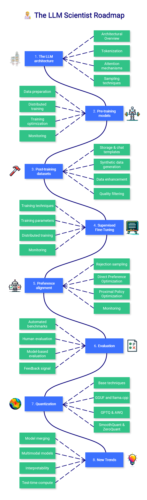
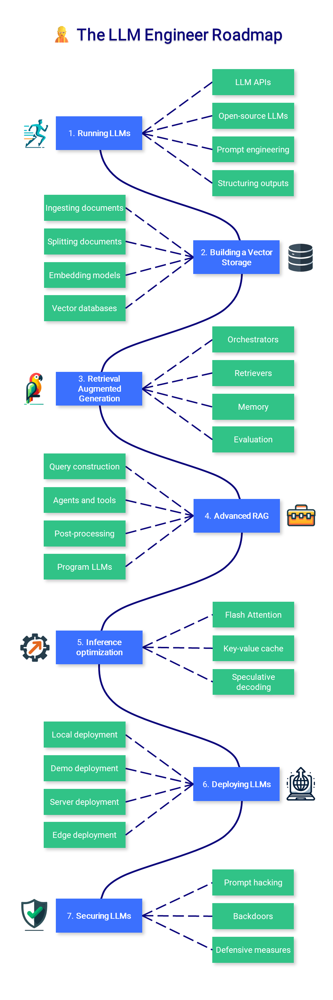

  

    🌐 <a href="https://github.com/ddkeeper/llm-wiki">GitHub</a> • 
    📖 <a href="your-documentation-link">Documentation</a> • 
    💡 <a href="your-contribution-guide">Contribute</a>
  

# LLM Wiki

!!! info "About this Wiki"
    This knowledge base is built upon and extends [Maximilian Labonne's LLM course](https://github.com/mlabonne/llm-course).
    Thanks to the original author for the open-source contribution!

Welcome to LLM Wiki! This is a comprehensive site focused on Large Language Model (LLM) knowledge. The content currently includes three main sections:

## 🧩 LLM Fundamentals

This section covers the essential knowledge required for building and understanding large language models, including:

* Mathematics Fundamentals
* Python Programming Basics
* Neural Networks Fundamentals
* Natural Language Processing Basics

!!! note "Note"
    The fundamentals section is optional. If you already have the relevant knowledge, you can proceed to the subsequent chapters. However, a solid foundation will help you better understand and apply LLM technology.

## 🧑‍🔬 LLM Scientist

This section focuses on building the best possible LLMs using the latest techniques, covering:

* LLM Architecture
* Model Pretraining
* Post-training Datasets
* Supervised Fine-tuning
* Preference Alignment
* Evaluation Methods
* Quantization Techniques
* New Trends

## 👷 LLM Engineer

This section focuses on creating production-ready LLM applications, covering:

* Running LLMs
* Building Vector Storage
* Retrieval-Augmented Generation (RAG)
* Advanced RAG Techniques
* Inference Optimization
* LLM Deployment
* LLM Security

## Learning Resources

Each topic comes with curated learning resources, including:

* 📚 Recommended Reading Materials
* 🎥 Video Tutorials
* 💻 Practical Code Examples
* 📝 Exercises

## Contributing

We welcome all forms of contributions, including but not limited to:

* Content Additions and Improvements
* Error Corrections
* New Topic Suggestions
* Documentation Translation

---

##Knowledge Sections## {: style="text-align: center;"}

-   🧩

    ---
    
    **LLM Fundamentals**{: .heading }
    
    [Start Learning](fundamentals/index.md){ .md-button }

-   🧑‍🔬

    ---
    
    **LLM Scientist**{: .heading }
    
    [Start Learning](scientist/index.md){ .md-button }

-   👷

    ---
    
    **LLM Engineer**{: .heading }
    
    [Start Learning](engineer/index.md){ .md-button }

-   🚧

    ---
    
    **More Content**{: .heading }
    
    Coming Soon...
    

