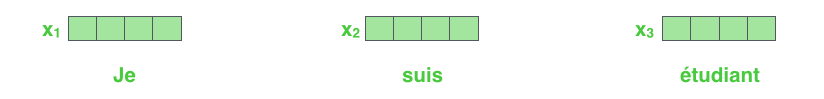
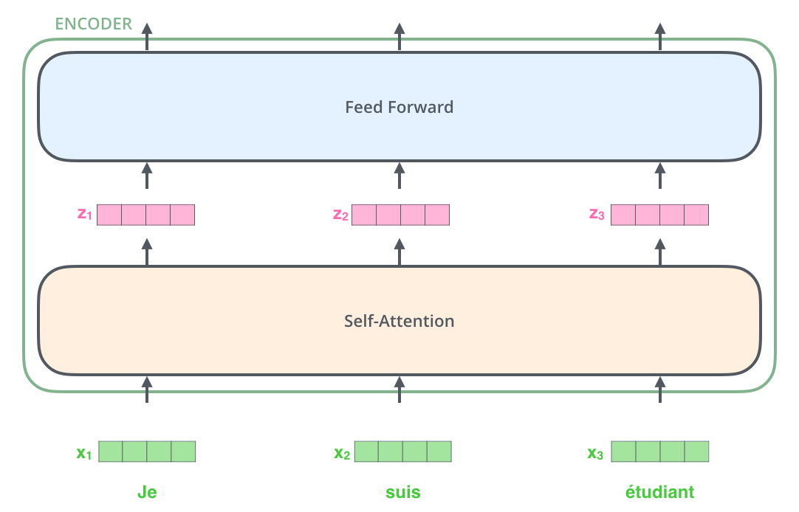
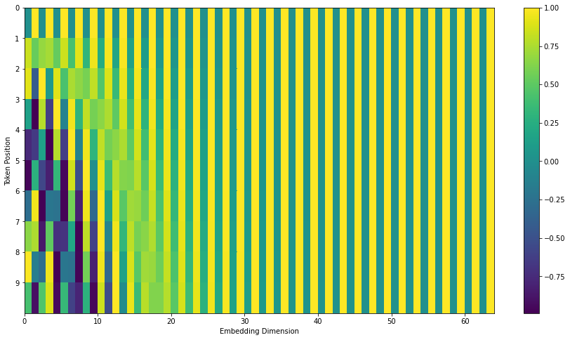
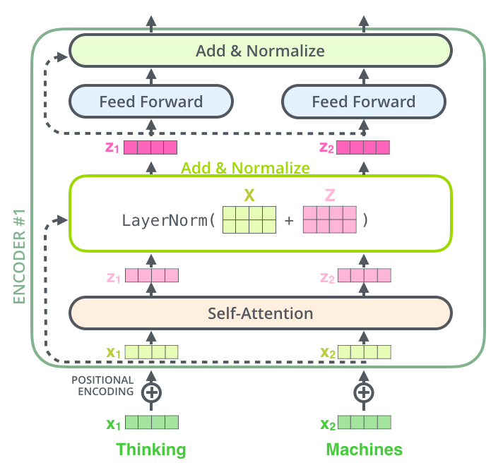
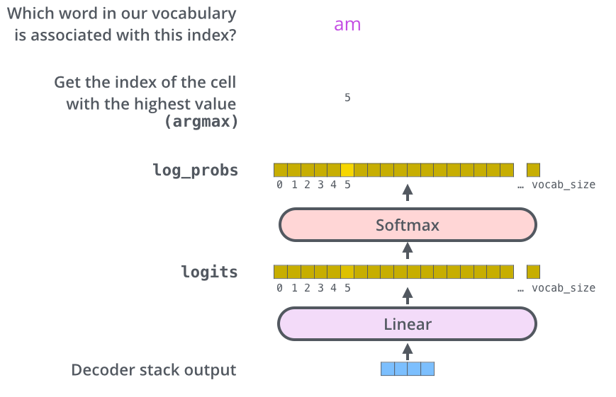

# “变形金刚” Transformer

!!! info "文档来源"
    本文档改编自 Jay Alammar 的 [The Illustrated Transformer](https://jalammar.github.io/illustrated-transformer/)。
    
    原作者：[Jay Alammar](https://jalammar.github.io/)

在本篇内容里, 我们将介绍 **Transformer** - 一个使用注意力机制来提高模型训练速度的模型。在特定任务中,Transformer 的表现超过了 Google 神经机器翻译模型。但最大的优势在于 Transformer 非常适合并行化处理。
接下来，让我们来分解这个模型, 看看它是如何工作的。

Transformer 最初在论文 [Attention is All You Need](https://arxiv.org/abs/1706.03762) 中提出， 其完整架构如下图所示 - 看上去有"亿"点复杂，别担心，在本篇内容中, 我们将尽量简化其中的概念, 将模型拆解成多个部分逐个介绍, 帮助大家轻松理解。

!!! important "Transformer 模型的实现"
    - [Tensor2Tensor](https://github.com/tensorflow/tensor2tensor) 包中提供了一个 TensorFlow 实现；
    - 哈佛大学的 NLP 小组创建了一个[使用 PyTorch 实现的注释版论文指南](https://nlp.seas.harvard.edu/annotated-transformer/)。

## 高层视角下的 Transformer

让我们首先将模型视为一个黑盒。在机器翻译应用中, 它会接收一种语言的句子, 输出另一种语言的翻译。

打开这个 "擎天柱" 式的黑盒, 我们可以看到一个编码组件、一个解码组件以及它们之间的连接。

编码组件由多个编码 (器) 块堆叠而成 (论文中堆叠了 6 个 — 6 这个数字并没有什么特别之处, 你完全可以尝试其他配置)。解码组件由相同数量的解码 (器) 块堆叠而成。

所有的编码块在结构上都是相同的 (但它们不共享权重)。每个编码块都可以分解为两个子层:

编码块的输入首先流经一个自注意力层 - 这一层帮助编码块在编码特定词时关注输入句子中的其他词。我们稍后会详细介绍自注意力机制。

自注意力层的输出被传递到一个前馈神经网络。完全相同的前馈网络被独立地应用于每个位置。

解码块也有这两层, 但在它们之间还有一个注意力层, 帮助解码块关注输入句子的相关部分 (类似于[序列到序列模型](./seq2seq.html)中的注意力机制)。

## 张量视角下的 Transformer

现在我们已经看到了模型的主要组件, 让我们开始关注各种向量/张量, 以及它们如何在这些组件之间流动,将训练模型的输入转换为输出。

和 NLP 应用中常见的一样, 我们首先使用**嵌入算法**将每个输入词转换为向量。

    
    

        每个词被嵌入到一个 512 维的向量中。我们用这些简单的方框来表示这些向量
    

嵌入只发生在最底层的编码块中。所有编码块的共同点是它们接收一个 512 维向量的列表，这些向量：

- 在最底层编码块中是词嵌入；
- 在其他编码块中是直接位于其下方的编码块的输出。

这个列表的大小是我们可以设置的超参数：一般来说它就是我们训练数据集中最长句子的长度。

将输入序列中的词转换为词嵌入后, 每个词都会流经编码块的两层。

在这里我们开始看到 Transformer 的一个关键特性, 即每个位置的词都在编码块中流经自己的路径。这些路径在自注意力层中存在依赖关系。然而, 前馈层没有这些依赖关系, 因此各个路径可以在流经前馈层时并行执行。

接下来, 我们将改用一个更短的句子作为例子, 看看在编码块的每个子层中发生了什么。

## 编码过程详解

如前面所说, 编码块接收一个向量列表作为输入。它通过将这些向量传递到 "自注意力" 层, 然后是前馈神经网络来处理这个列表, 最后将输出向上发送到下一个编码器。

    
    

        每个位置的词都经过自注意力处理。然后,它们各自通过一个前馈神经网络 - 对每个向量使用完全相同的网络
    

## 自注意力机制概述

别被我随意使用 "自注意力" 这个词误导, 好像这是每个人都应该熟悉的概念。事实上, 在阅读《Attention is All You Need》这篇论文之前,我个人从未接触过这个概念。让我们来详细解释它是如何工作的。

假设下面这个句子是我们要翻译的输入句子:

"The animal didn't cross the street because it was too tired"
{: style="color: rgb(179, 18, 18); font-size: 1.2em"} 

这个句子中的 "it" 指的是什么？是指街道还是动物？对人类来说这是一个简单的问题, 但对算法来说并不那么简单。

当模型处理 "it" 这个词时,自注意力机制允许它将 "it" 与 "animal" 联系起来。

当模型处理输入序列中的每个词 (每个位置) 时,自注意力允许它查看输入序列中的其他位置， 寻找可以帮助更好地编码当前词的线索。

如果你熟悉 RNN, 可以想想 RNN 如何通过维护隐藏状态来将之前处理过的词/向量的表示与当前正在处理的词结合起来。自注意力是 Transformer 用来将其他相关词的 "理解" 融入到当前正在处理的词中的方法。

    
    

        当我们在编码器 (堆栈中最顶层的编码器) 中编码 "it" 这个词时, 注意力机制的一部分聚焦在 "The Animal" 上, 并将其表示的一部分融入到 "it" 的编码中
    

更直观的内容可以查看 [Tensor2Tensor notebook](https://colab.research.google.com/github/tensorflow/tensor2tensor/blob/master/tensor2tensor/notebooks/hello_t2t.ipynb) ：在那里你可以加载一个 Transformer 模型,并使用这个交互式可视化工具来检查它。

## 自注意力机制详解

让我们首先看看如何使用向量计算自注意力，然后再看看它实际上是如何用矩阵实现的。

计算自注意力的 **第一步** 是从每个编码器的输入向量（在这种情况下是每个词的嵌入）创建三个向量。因此，对于每个词，我们创建一个查询向量（Query vector）、一个键向量（Key vector）和一个值向量（Value vector）。这些向量是通过将嵌入与我们在训练过程中训练的三个矩阵相乘来创建的。

注意，这些新向量的维度比嵌入向量小。它们的维度是 64，而嵌入和编码器输入/输出向量的维度是 512。它们不是必须更小，这是一个架构选择，使多头注意力的计算（大部分）保持恒定。

    
    

    将 \( x_1 \) 乘以 \( W^Q \) 权重矩阵时，会产生 \( q_1 \)，即该词相关的 "查询" 向量。最终我们会为输入句子中的每个词创建 "查询" (\( Q \))、"键"(\( K \)) 和"值"(\( V \)) 投影
    

什么是 "查询"、"键" 和 "值" 向量？它们是对计算和思考注意力有用的抽象概念。当你继续阅读下面如何计算注意力时，你就会知道这些向量各自扮演的角色了。

计算自注意力的 **第二步** 是计算分数。假设我们正在计算这个例子中第一个词 "Thinking" 的自注意力。我们需要对输入句子中的每个词与这个词进行评分。这个分数决定了我们在编码某个位置的词时，要把多少注意力放在输入句子的其他部分上。

分数是通过将 **查询向量** 与我们正在评分的相应词的 **键向量** 做点积来计算的。所以如果我们正在处理位置 #1 的自注意力，第一个分数将是 \( q_1 \)  和 \( k_1 \)  的点积。第二个分数将是 \( q_1 \)  和 \( k_2 \) 的点积。

{: style="display: block; margin: 0 auto; max-width: 80%;"}

**第三步和第四步** 是将分数除以 8（论文中使用的键向量维度 64 的平方根。这样做可以获得更稳定的梯度。这里可以使用其他可能的值，但这是默认值），然后通过 softmax 操作。Softmax 将分数标准化，使它们都是正数且加起来等于 1。

{: style="display: block; margin: 0 auto; max-width: 80%;"}

这个 softmax 分数决定了每个词在这个位置上的表达程度。显然，这个位置的词本身会有最高的 softmax 分数，但有时关注与当前词相关的另一个词也很有用。
{: style="text-align: center; font-size: 0.8em;"}

**第五步** 是将每个值向量乘以其 softmax 分数（为了准备后续的求和）。这样做的直觉是保持我们想要关注的词的值不变，而将不相关的词的值 "淹没"（如通过将它们乘以 0.001 这样的很小的数）。

**第六步** 是将加权值向量相加。这就产生了这个位置（对于第一个词）的自注意力层的输出。

{: style="display: block; margin: 0 auto; max-width: 80%;"}

这就完成了自注意力的计算。得到的向量是我们可以传递给前馈神经网络的向量。然而，在实际实现中，这个计算是以矩阵形式完成的，以加快处理速度。我们已经看到了词级别形式的计算，接下来让我们来看看该计算的矩阵形式。

## 矩阵形式的自注意力计算

**第一步** 是计算查询、键和值矩阵。我们通过将嵌入打包成矩阵 X，并将其与我们训练过的权重矩阵（ \( W^Q \) 、\( W^Q \)、\( W^V \)）相乘来实现这一点。

{: style="display: block; margin: 0 auto; max-width: 80%;"}

\( X \) 矩阵中的每一行对应输入句子中的一个词。我们再次看到嵌入向量（512 或图中的 4 个方框）和 q/k/v 向量（64，或图中的 3 个方框）的尺寸差异
{: style="text-align: center; font-size: 0.8em;"}

**最后**，由于我们使用的是矩阵，我们可以将步骤二到六压缩成一个公式来计算自注意力层的输出。

{: style="display: block; margin: 0 auto; max-width: 80%;"}

矩阵形式的自注意力计算
{: style="text-align: center; font-size: 0.8em;"}

## 多头"野兽" - 多头注意力机制

论文通过添加一个称为 "多头" 注意力的机制进一步改进了自注意力层。这从两个方面提高了注意力层的性能：

- 它扩展了模型关注不同位置的能力。是的，在上面的例子中，\( z_1 \) 包含了每个其他编码的一点信息，但它可能被实际的词本身所主导。如果我们要翻译 "The animal didn't cross the street because it was too tired" 这样的句子，知道 "it" 指代的是哪个词会很有用。
- 它给注意力层提供了多个 "表示子空间"。如下所示，使用多头注意力时，我们不仅有一组，而是有多组查询/键/值权重矩阵（Transformer 使用八个注意力头），每组矩阵都是独立随机初始化的。然后，在训练之后，每组都用于将输入嵌入（或来自较低编码块/解码块的向量）投影到不同的表示子空间中。

{: style="display: block; margin: 0 auto; max-width: 80%;"}

对于多头注意力，我们为每个头部维护单独的 Q/K/V 权重矩阵，从而产生不同的 Q/K/V 矩阵。就像我们之前做的那样，我们将 \( X \) 乘以 \( W^Q \)/\( W^Q \)/\( W^V \) 来产生 Q/K/V 矩阵。
{: style="text-align: center; font-size: 0.8em;"}

如果我们用不同的权重矩阵进行八次上述的自注意力计算，我们最终会得到八个不同的 Z 矩阵。

{: style="display: block; margin: 0 auto; max-width: 80%;"}

这给我们带来了一个小挑战。前馈层不期望得到八个矩阵 —— 它期望得到一个矩阵（每个词一个向量）。所以我们需要一种方法将这八个矩阵压缩成一个矩阵。

我们如何做到这一点？我们将这些矩阵连接起来，然后乘以一个额外的权重矩阵 \( W^O \)。

{: style="display: block; margin: 0 auto; max-width: 80%;"}

这就是多头自注意力的全部内容了。我知道这涉及相当多的矩阵。让我试着把它们都放在一个可视化图中，一览无余：

{: style="display: block; margin: 0 auto; max-width: 80%;"}

现在我们已经讨论了注意力头，让我们回到之前的例子，看看在我们编码例句中的 "it" 这个词时，不同的注意力头关注的焦点：

{: style="display: block; margin: 0 auto; max-width: 80%;"}

当我们编码 "it" 这个词时，一个注意力头主要关注 "the animal"，而另一个则关注 "tired" —— 从某种意义上说，模型对 "it" 这个词的表示融合了 "animal" 和 "tired" 两个词的表示
{: style="text-align: center; font-size: 0.8em;"}

然而，如果我们将所有注意力头都加入到图中，事情可能就更难解释了：

{: style="display: block; margin: 0 auto; max-width: 80%;"}

## 使用位置编码表示单词顺序

到目前为止，我们描述的模型中还缺少一个关键要素 —— 一种考虑输入序列中词序的方法。

为了解决这个问题，Transformer 为每个输入的嵌入添加了一个向量。这些向量遵循模型在训练过程中学习到的特定模式，有助于确定每个词的位置，或序列中不同词之间的距离。这里的直觉是，将这些值添加到嵌入中后，可以在进行点积注意力计算时，为向量之间提供有意义的距离关系。

{: style="display: block; margin: 0 auto; max-width: 80%;"}

为了让模型感知词的顺序，我们添加了位置编码向量 - 这些向量的值遵循特定的模式
{: style="text-align: center; font-size: 0.8em;"}

如果我们假设词嵌入的维度是 4，实际的位置编码会是这样的：

{: style="display: block; margin: 0 auto; max-width: 80%;"}

一个长度为 4 的词嵌入的位置编码实例
{: style="text-align: center; font-size: 0.8em;"}

这种模式可能是什么样的呢？在下图中，每一行对应一个向量的位置编码。因此第一行是我们要添加到输入序列中第一个词嵌入上的向量。每一行包含 512 个值，每个值的范围在 1 到 -1 之间。不同的颜色编码显示出了这种模式。

{: style="display: block; margin: 0 auto; max-width: 80%;"}

一个针对 20 个词（行）和 512 维嵌入大小（列）的实际位置编码示例。你可以看到它在中心位置呈现分裂。这是因为左半部分的值由一个函数（使用正弦）生成，而右半部分由另一个函数（使用余弦）生成。然后将它们连接起来形成每个位置编码向量。
{: style="text-align: center; font-size: 0.8em;"}

位置编码的公式在论文的 3.5 节中有描述。你可以在 [`get_timing_signal_1d()`](https://github.com/tensorflow/tensor2tensor/blob/23bd23b9830059fbc349381b70d9429b5c40a139/tensor2tensor/layers/common_attention.py) 中看到生成位置编码的代码。这并不是实现位置编码的唯一方法，但它有一个优势-可以很方便地扩展到任意长度的序列上（比如我们的训练模型被要求翻译一个比训练集中任何句子都长的句子）。

上面显示的位置编码来自 Tensor2Tensor 实现的 Transformer。论文中展示的方法略有不同，它不是直接连接，而是交织两个信号。下图展示了这种效果。[这里是生成该图的代码](https://github.com/jalammar/jalammar.github.io/blob/master/notebookes/transformer/transformer_positional_encoding_graph.ipynb)：

{: style="display: block; margin: 0 auto; max-width: 80%;"}

## 残差连接

在继续讨论之前，我们需要提到编码器架构中的一个重要细节：在每个编码器中的每个子层（自注意力、前馈网络）周围都有一个残差连接，并且后面跟着一个[层归一化](https://arxiv.org/abs/1607.06450)步骤。

{: style="display: block; margin: 0 auto; max-width: 80%;"}

如果我们要可视化与自注意力相关的向量和层归一化操作，它会是这样的：

{: style="display: block; margin: 0 auto; max-width: 80%;"}

这同样适用于解码器的子层。如果我们考虑一个 2 个堆叠的编码块和解码块组成的 Transformer，它看起来会是这样：

{: style="display: block; margin: 0 auto; max-width: 80%;"}

## 解码器部分

现在我们已经介绍了编码器端的大部分概念，解码器端的工作过程和编码器高度类似，我们基本上也了解了。下面让我们看看它们是如何协同工作的。

编码器首先处理输入序列。然后将顶层编码块的输出转换为一组注意力向量 K 和 V。这些将被每个解码器用在其 "encoder-decoder attention" 层（有时也被称为交叉注意力层）中，这有助于解码器将注意力集中在输入序列的适当位置：

{: style="display: block; margin: 0 auto; max-width: 80%;"}

在完成编码阶段后，我们开始解码阶段。解码阶段的每一步都会输出一个输出序列中的元素（在这个例子中是英语翻译句子）
{: style="text-align: center; font-size: 0.8em;"}

往下一直重复这个过程，直到遇到一个特殊的结束符号，此时表明 Transformer 解码器已完成其输出。每一步的输出都被输入到下一个时间步的解码块的底部，解码器就像编码器一样将它们的解码结果向上传递。我们还像处理编码器输入一样，对这些解码器输入进行嵌入和位置编码，以表示每个词的位置。

{: style="display: block; margin: 0 auto; max-width: 80%;"}

解码器中的自注意力层与编码器中的工作方式略有不同：

在解码器中，自注意力层只允许关注输出序列中的早期位置。这是通过在自注意力计算的 softmax 步骤之前屏蔽（通过掩码矩阵设置为 `-inf`）未来位置来实现的。

"编码器-解码器注意力" 层的工作方式与多头自注意力类似，只是 Q/K/V 的来源（更直白一点，\( X_Q \)/\( X_K \)/\( X_V \) 的来源）不完全相同：它的查询（Q）直接来自于下层（下层解码块的输出或者解码器部分的输入-编码器已经生成的词序列），但 **键（K）和值（V）来自于最顶层编码块的输出**{: style="color: rgb(179, 18, 18);"} 。

## 最终的线性层和 Softmax 层

解码器堆栈输出一个浮点数向量。那么如何将这个向量转换成词呢？这就是最终的线性层和 Softmax 层要完成的工作。

线性层是一个简单的全连接神经网络，它的作用是将解码器堆栈产生的向量投影到一个更大的向量中，我们称之为 logits 向量。

假设我们的模型从训练数据集中学习了 10,000 个独特的英语单词（这就是我们模型的"输出词汇表"）。这样的话，logits 向量的宽度就会是 10,000 个单元格 —— 每个单元格对应着一个独特单词的分数。这就是我们如何解释经过模型和线性层处理后的输出。

Softmax 层随后会将这些分数转换为概率（所有值都是正数，且加起来等于 1.0）。选择概率最高的单元格，该单元格对应的词就是这个时间步的输出。

{: style="display: block; margin: 0 auto; max-width: 80%;"}

这张图从底部开始，展示了解码器堆栈输出的向量是如何被转换成输出词的
{: style="text-align: center; font-size: 0.8em;"}

## 训练过程回顾

现在我们已经介绍了训练好的 Transformer 的整个前向传播过程，回顾一下模型训练的直观认识会很有帮助。

在训练过程中，一个未经训练的模型会经历完全相同的前向传播过程。但由于我们是在带标签的训练数据集上训练它，我们可以将其输出与实际正确的输出进行比较。

为了便于理解，让我们假设我们的输出词汇表只包含六个词（"a"、"am"、"i"、"thanks"、"student" 和 "<eos>"（"end of sentence" 的缩写））。

{: style="display: block; margin: 0 auto; max-width: 80%;"}

我们模型的输出词汇表是在预处理阶段创建的，在开始训练之前就已经确定。{: style="text-align: center; font-size: 0.8em;"}

一旦我们定义了输出词汇表，我们就可以使用相同宽度的向量来表示词汇表中的每个词。这种方法也被称为 one-hot 编码。例如，我们可以用以下向量来表示词 "am"：

{: style="display: block; margin: 0 auto; max-width: 80%;"}

输出词汇表的 one-hot 编码示例
{: style="text-align: center; font-size: 0.8em;"}

在回顾完这段训练过程后，我们继续来讨论一下模型的损失函数——这是我们在训练阶段朝着优化的指标，这样就很有希望训练出一个准确率惊人的模型。

## 损失函数

假设我们正在训练我们的模型。假设这是训练阶段的第一步，我们正在用一个简单的例子训练它 — 将 "merci" 翻译成 "thanks"。

这意味着，我们希望输出是一个概率分布，指向词 "thanks"。但由于这个模型还没有经过训练，这种情况不太可能发生。

{: style="display: block; margin: 0 auto; max-width: 80%;"}

由于模型的参数（权重）都是随机初始化的，（未训练的）模型会为每个单元格/词产生带有任意值的概率分布。我们可以将其与实际输出进行比较，然后使用反向传播调整所有模型的权重，使输出更接近期望的输出。
{: style="text-align: center; font-size: 0.8em;"}

如何比较两个概率分布？我们只需要将两者作差。更多细节请查看 [cross-entropy](https://colah.github.io/posts/2015-09-Visual-Information/) 和 [Kullback–Leibler divergence](https://www.countbayesie.com/blog/2017/5/9/kullback-leibler-divergence-explained)。

但请注意，这是一个过于简化的例子。实际情况是，我们会使用比一个词更长的句子。例如 — 输入："je suis étudiant" 和期望输出："i am a student"。这实际上意味着，我们希望我们的模型依次输出概率分布，其中：

* 每个概率分布都由一个宽度为 vocab_size 的向量表示（在我们的玩具示例中是 6，但更实际的数字是 30,000 或 50,000）
* 第一个概率分布在与词 "i" 相关的单元格中具有最高概率
* 第二个概率分布在与词 "am" 相关的单元格中具有最高概率
* 以此类推，直到第五个输出分布指向 `<end of sentence>` 符号，它也在 10,000 元素词汇表中有一个相关的单元格

{: style="display: block; margin: 0 auto; max-width: 80%;"}

一个样本句子的训练示例中我们朝着训练模型的目标概率分布
{: style="text-align: center; font-size: 0.8em;"}

在对足够大的数据集训练足够长时间后，我们希望产生的概率分布看起来像这样：

{: style="display: block; margin: 0 auto; max-width: 80%;"}

经过训练后，模型很有希望输出我们期望的正确翻译。当然，如果这个短语是训练数据集的一部分，这并不能说明什么（参见：[交叉验证](https://www.youtube.com/watch?v=TIgfjmp-4BA)）。注意，每个位置都会得到一点概率，即使它不太可能是该时间步的输出 —— 这是 softmax 的一个非常有用的特性，有助于训练过程。
{: style="text-align: center; font-size: 0.8em;"}

现在，由于模型一次产生一个输出，我们可以假设模型从该概率分布中选择概率最高的词并丢弃其余部分。这是一种方法（称为贪婪解码）。另一种方法是保留，比如说，前两个词（例如 "I" 和 "a"），然后在下一步运行模型两次：一次假设第一个输出位置是词 "I"，另一次假设第一个输出位置是词 "a"，并且保留考虑位置 #1 和 #2 时产生较少错误的版本。我们对位置 #2 和 #3 重复这个过程直至最后一个位置。这种方法称为 "束搜索"，在我们的例子中，beam_size 是 2（意味着在任何时候，内存中都保持两个未完成的翻译假设），top_beams 也是 2（意味着我们将返回两个翻译）。这些都是你可以实验的超参数。

## 探索更多！

希望这篇内容成为你攻克 Transformer 中的重点与难点的起点。如果你想深入了解，可以按照 “我” 的建议执行如下步骤：

* 阅读 [Attention Is All You Need](https://arxiv.org/abs/1706.03762) 论文、Transformer 博客文章（[Transformer: A Novel Neural Network Architecture for Language Understanding](https://ai.googleblog.com/2017/08/transformer-novel-neural-network.html)）和 [Tensor2Tensor 发布公告](https://ai.googleblog.com/2017/06/accelerating-deep-learning-research.html)。

* 观看 [Łukasz Kaiser 的演讲](https://www.youtube.com/watch?v=rBCqOTEfxvg)，他详细介绍了模型及其细节。

* 尝试 [作为 Tensor2Tensor 代码库一部分提供的 Jupyter Notebook](https://colab.research.google.com/github/tensorflow/tensor2tensor/blob/master/tensor2tensor/notebooks/hello_t2t.ipynb)。

* 探索 [Tensor2Tensor 代码库](https://github.com/tensorflow/tensor2tensor)。